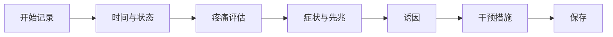
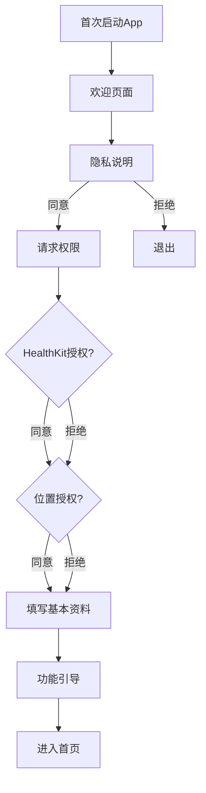
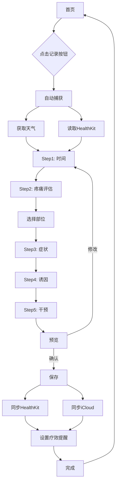
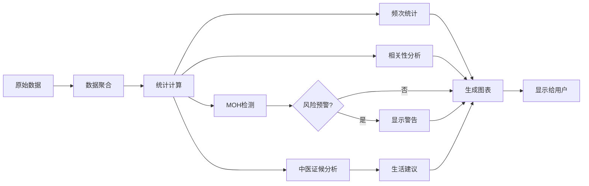

# 偏头痛记录App - UI/UX设计文档

**版本**: 1.0  
**最后更新**: 2026年2月1日  
**设计平台**: iOS 17.0+  
**设计工具**: SwiftUI, SF Symbols, Human Interface Guidelines

---

## 目录

1. [设计理念与原则](#1-设计理念与原则)
2. [设计系统](#2-设计系统)
3. [核心页面设计](#3-核心页面设计)
4. [交互设计规范](#4-交互设计规范)
5. [辅助功能](#5-辅助功能)
6. [用户流程图](#6-用户流程图)
7. [响应式设计](#7-响应式设计)
8. [设计资产清单](#8-设计资产清单)

---

## 1. 设计理念与原则

### 1.1 核心设计理念

#### 患者至上（Patient-First Design）

偏头痛发作时，患者处于极度痛苦状态，伴有畏光、恶心等症状。设计必须：

- **暗黑模式优先**: 默认使用纯黑背景，最大程度减少光线刺激
- **极简操作**: 发作时的核心功能（开始记录）必须一键完成
- **视觉舒适**: 避免高对比度、强色彩、频繁动画

#### 医疗级严谨（Medical-Grade Accuracy）

作为辅助医疗诊断的工具：

- **标准化表单**: 遵循IHS ICHD-3标准和《中国偏头痛诊断与治疗指南》
- **清晰的数据层级**: 区分"必填"和"可选"信息
- **专业术语**: 使用医学标准术语，同时提供通俗解释

#### 情感关怀（Empathetic Experience）

- **正向反馈**: 突出显示"无头痛连续天数"，给予心理支持
- **非侵入式提醒**: 用药提醒温和不强迫
- **隐私保护**: 所有数据本地存储，无需注册账号

### 1.2 设计原则

1. **减少认知负荷**: 每屏最多3个操作选项
2. **视觉层级清晰**: 使用字重、尺寸、颜色建立信息层级
3. **一致性**: 全局统一的组件样式和交互模式
4. **可逆性**: 所有操作可撤销或编辑
5. **渐进式披露**: 高级功能不干扰基础流程

---

## 2. 设计系统

### 2.1 色彩系统（Color Palette）

#### 主色调（Primary Colors）

```swift
// 柔和的青紫色 - 主品牌色
Color.accentColor = Color(red: 0.42, green: 0.62, blue: 0.85) // #6B9ED9

// 辅助色 - 用于强调和区分
Color.secondary = Color(red: 0.73, green: 0.56, blue: 0.85) // #BA8FD9
```

**设计理由**:
- 蓝色系具有镇静、安抚作用
- 低饱和度避免刺激
- 在暗黑背景下柔和可见

#### 背景色（Background Colors）

```swift
// 深色模式（默认）
Color.background = Color.black // 纯黑 #000000
Color.secondaryBackground = Color(white: 0.11) // #1C1C1E (系统深灰)
Color.tertiaryBackground = Color(white: 0.17) // #2C2C2E

// 浅色模式（可选）
Color.lightBackground = Color(white: 0.95) // #F2F2F7
Color.lightSecondaryBackground = Color.white
```

#### 文字色（Text Colors）

```swift
// 深色模式
Color.primaryText = Color(white: 0.92) // 主要文字
Color.secondaryText = Color(white: 0.64) // 次要文字
Color.tertiaryText = Color(white: 0.48) // 说明性文字

// 使用系统颜色适应用户设置
Color.primaryText = Color.primary
Color.secondaryText = Color.secondary
```

#### 语义色（Semantic Colors）

```swift
// 成功 - 低饱和度绿色
Color.success = Color(red: 0.20, green: 0.78, blue: 0.35) // #34C759

// 警告 - 低饱和度橙色
Color.warning = Color(red: 1.0, green: 0.62, blue: 0.04) // #FF9F0A

// 危险 - 低饱和度红色（MOH警告）
Color.danger = Color(red: 1.0, green: 0.27, blue: 0.23) // #FF453A

// 信息 - 柔和蓝色
Color.info = Color(red: 0.04, green: 0.52, blue: 1.0) // #0A84FF
```

#### 疼痛强度色阶（Pain Intensity Scale）

```swift
// 用于可视化疼痛等级 0-10
let painColors: [Color] = [
    Color(red: 0.20, green: 0.78, blue: 0.35), // 0 - 绿色（无痛）
    Color(red: 0.40, green: 0.80, blue: 0.40), // 1-2 - 浅绿
    Color(red: 0.67, green: 0.87, blue: 0.47), // 3 - 黄绿
    Color(red: 1.0, green: 0.92, blue: 0.04),  // 4-5 - 黄色
    Color(red: 1.0, green: 0.78, blue: 0.04),  // 6 - 橙黄
    Color(red: 1.0, green: 0.62, blue: 0.04),  // 7 - 橙色
    Color(red: 1.0, green: 0.45, blue: 0.04),  // 8 - 深橙
    Color(red: 1.0, green: 0.27, blue: 0.23)   // 9-10 - 红色（剧痛）
]
```

### 2.2 字体系统（Typography）

#### 字体族（Font Family）

全局使用Apple SF Pro系统字体，确保最佳可读性和与iOS生态一致性。

```swift
// 标题层级
Font.largeTitle // 34pt, Bold - 页面主标题
Font.title // 28pt, Bold - 卡片标题
Font.title2 // 22pt, Bold - 次级标题
Font.title3 // 20pt, Semibold - 组标题

// 正文层级
Font.body // 17pt, Regular - 主要内容
Font.callout // 16pt, Regular - 辅助说明
Font.subheadline // 15pt, Regular - 列表项
Font.footnote // 13pt, Regular - 注释
Font.caption // 12pt, Regular - 图表标签
Font.caption2 // 11pt, Regular - 时间戳
```

#### 字重（Font Weight）

```swift
// 层级区分
Font.Weight.bold // 关键信息、标题
Font.Weight.semibold // 次要标题
Font.Weight.regular // 正文
Font.Weight.light // 次要信息（谨慎使用）
```

#### 动态类型支持（Dynamic Type）

所有文字必须支持用户的辅助功能字体设置：

```swift
Text("疼痛强度")
    .font(.body)
    .dynamicTypeSize(.xSmall ... .xxxLarge) // 限制范围避免布局破坏
```

### 2.3 间距系统（Spacing System）

基于8点网格系统（8pt Grid）：

```swift
enum Spacing {
    static let xxs: CGFloat = 4   // 极小间距
    static let xs: CGFloat = 8    // 小间距
    static let sm: CGFloat = 12   // 较小间距
    static let md: CGFloat = 16   // 标准间距
    static let lg: CGFloat = 24   // 大间距
    static let xl: CGFloat = 32   // 更大间距
    static let xxl: CGFloat = 48  // 巨大间距
}
```

**应用场景**:
- `xxs (4pt)`: 图标与文字间距
- `xs (8pt)`: 列表项内部元素间距
- `sm (12pt)`: 卡片内部padding
- `md (16pt)`: 页面标准边距
- `lg (24pt)`: 卡片之间间距
- `xl (32pt)`: section之间间距
- `xxl (48pt)`: 页面顶部到第一个元素

### 2.4 圆角与阴影（Corner Radius & Shadow）

```swift
enum CornerRadius {
    static let sm: CGFloat = 8    // 小组件
    static let md: CGFloat = 12   // 卡片
    static let lg: CGFloat = 16   // 大卡片
    static let xl: CGFloat = 24   // 主按钮
    static let full: CGFloat = 999 // 圆形按钮
}

// 阴影
enum Shadow {
    static let card = Color.black.opacity(0.2)
    static let cardOffset: CGSize = CGSize(width: 0, height: 2)
    static let cardRadius: CGFloat = 8
}
```

### 2.5 组件库（Component Library）

#### 按钮样式（Buttons）

**主按钮（Primary Button）**

```swift
struct PrimaryButton: View {
    let title: String
    let action: () -> Void
    
    var body: some View {
        Button(action: action) {
            Text(title)
                .font(.headline)
                .foregroundColor(.white)
                .frame(maxWidth: .infinity)
                .padding()
                .background(Color.accentColor)
                .cornerRadius(CornerRadius.xl)
        }
    }
}
```

**视觉规范**:
- 高度: 56pt
- 圆角: 24pt
- 字体: Headline (17pt Bold)
- 最小宽度: 280pt

**次按钮（Secondary Button）**

```swift
struct SecondaryButton: View {
    let title: String
    let action: () -> Void
    
    var body: some View {
        Button(action: action) {
            Text(title)
                .font(.headline)
                .foregroundColor(.accentColor)
                .frame(maxWidth: .infinity)
                .padding()
                .background(Color.secondaryBackground)
                .cornerRadius(CornerRadius.xl)
                .overlay(
                    RoundedRectangle(cornerRadius: CornerRadius.xl)
                        .stroke(Color.accentColor, lineWidth: 2)
                )
        }
    }
}
```

**图标按钮（Icon Button）**

```swift
struct IconButton: View {
    let icon: String // SF Symbol
    let action: () -> Void
    
    var body: some View {
        Button(action: action) {
            Image(systemName: icon)
                .font(.title2)
                .foregroundColor(.primaryText)
                .frame(width: 44, height: 44)
                .background(Color.secondaryBackground)
                .clipShape(Circle())
        }
    }
}
```

#### 卡片样式（Cards）

**标准卡片**

```swift
struct InfoCard<Content: View>: View {
    let content: Content
    
    init(@ViewBuilder content: () -> Content) {
        self.content = content()
    }
    
    var body: some View {
        content
            .padding(Spacing.md)
            .background(Color.secondaryBackground)
            .cornerRadius(CornerRadius.md)
            .shadow(
                color: Shadow.card,
                radius: Shadow.cardRadius,
                x: Shadow.cardOffset.width,
                y: Shadow.cardOffset.height
            )
    }
}
```

**视觉规范**:
- 背景色: secondaryBackground (#1C1C1E)
- 圆角: 12pt
- 内边距: 16pt
- 阴影: 黑色20%透明度，offset (0, 2)，blur 8pt

#### 输入控件（Input Controls）

**文本输入框**

```swift
struct TextFieldStyle: ViewModifier {
    func body(content: Content) -> some View {
        content
            .padding()
            .background(Color.tertiaryBackground)
            .cornerRadius(CornerRadius.md)
            .overlay(
                RoundedRectangle(cornerRadius: CornerRadius.md)
                    .stroke(Color.secondary.opacity(0.3), lineWidth: 1)
            )
    }
}
```

**选择器（标签云）**

用于症状、诱因选择：

```swift
struct SelectableChip: View {
    let label: String
    @Binding var isSelected: Bool
    
    var body: some View {
        Text(label)
            .font(.subheadline)
            .padding(.horizontal, Spacing.sm)
            .padding(.vertical, Spacing.xs)
            .background(isSelected ? Color.accentColor : Color.tertiaryBackground)
            .foregroundColor(isSelected ? .white : .primaryText)
            .cornerRadius(CornerRadius.sm)
            .overlay(
                RoundedRectangle(cornerRadius: CornerRadius.sm)
                    .stroke(isSelected ? Color.clear : Color.secondary.opacity(0.3), lineWidth: 1)
            )
    }
}
```

**滑块（Slider）**

用于疼痛强度评估：

```swift
struct PainIntensitySlider: View {
    @Binding var value: Int
    
    var body: some View {
        VStack(spacing: Spacing.md) {
            // 表情图标反馈
            Image(systemName: painFaceIcon)
                .font(.system(size: 60))
                .foregroundColor(painColor)
            
            // 大数字显示
            Text("\(value)")
                .font(.system(size: 72, weight: .bold))
                .foregroundColor(painColor)
            
            // 滑块
            Slider(
                value: Binding(
                    get: { Double(value) },
                    set: { value = Int($0) }
                ),
                in: 0...10,
                step: 1
            )
            .tint(painColor)
            
            // 描述文字
            HStack {
                Text("无痛")
                    .font(.caption)
                    .foregroundColor(.secondaryText)
                Spacer()
                Text("剧痛")
                    .font(.caption)
                    .foregroundColor(.secondaryText)
            }
        }
    }
    
    var painColor: Color {
        painColors[value]
    }
    
    var painFaceIcon: String {
        switch value {
        case 0...2: return "face.smiling"
        case 3...5: return "face.dashed"
        case 6...7: return "face.frowning"
        case 8...10: return "face.crying"
        default: return "face.neutral"
        }
    }
}
```

---

## 3. 核心页面设计

### 3.1 首页（Home Dashboard）

#### 设计目标

- 一眼了解当前状态（是否有发作、连续无痛天数）
- 快速开始记录
- 查看环境风险因素

#### 布局结构

```
┌────────────────────────────────┐
│  Navigation Bar                │
│  "今天" [Settings Icon]        │
├────────────────────────────────┤
│                                │
│  ┌──────────────────────────┐ │
│  │  状态卡片                │ │
│  │  "您已连续 12 天无头痛" │ │
│  │  🎉                      │ │
│  └──────────────────────────┘ │
│                                │
│  ┌──────────────────────────┐ │
│  │  环境诱因卡片            │ │
│  │  气压: 1013 hPa ↓       │ │
│  │  湿度: 75% 🌧️           │ │
│  └──────────────────────────┘ │
│                                │
│         ┌──────────┐          │
│         │  [开始   │          │
│         │   记录]  │          │
│         │    +     │          │
│         └──────────┘          │
│                                │
│  ┌──────────────────────────┐ │
│  │  每日任务                │ │
│  │  ☑️ 服用预防性药物       │ │
│  │  ☐ 确认昨晚睡眠质量     │ │
│  └──────────────────────────┘ │
│                                │
└────────────────────────────────┘
    Tab Bar: 首页 | 日历 | ...
```

#### 关键组件

**1. 状态卡片（Status Card）**

```swift
struct StatusCard: View {
    let streakDays: Int
    let hasOngoingAttack: Bool
    
    var body: some View {
        InfoCard {
            VStack(spacing: Spacing.sm) {
                if hasOngoingAttack {
                    // 发作进行中
                    HStack {
                        Image(systemName: "exclamationmark.triangle.fill")
                            .foregroundColor(.warning)
                        Text("发作进行中")
                            .font(.title3)
                            .fontWeight(.semibold)
                    }
                    Text("已持续 2小时30分")
                        .font(.subheadline)
                        .foregroundColor(.secondaryText)
                } else {
                    // 无发作
                    Text("🎉")
                        .font(.system(size: 48))
                    Text("您已连续 \(streakDays) 天无头痛")
                        .font(.title3)
                        .fontWeight(.semibold)
                        .multilineTextAlignment(.center)
                }
            }
            .frame(maxWidth: .infinity)
            .padding(.vertical, Spacing.md)
        }
    }
}
```

**视觉规范**:
- 卡片高度: 自适应内容
- 表情符号大小: 48pt
- 主文字: Title3 Semibold
- 次文字: Subheadline

**2. 核心记录按钮（Primary Action Button）**

```swift
struct RecordButton: View {
    let action: () -> Void
    
    var body: some View {
        Button(action: action) {
            VStack(spacing: Spacing.xs) {
                Image(systemName: "plus.circle.fill")
                    .font(.system(size: 64))
                Text("开始记录")
                    .font(.headline)
            }
            .foregroundColor(.accentColor)
            .frame(width: 160, height: 160)
            .background(
                Circle()
                    .fill(Color.secondaryBackground)
                    .shadow(color: Shadow.card, radius: 12, x: 0, y: 4)
            )
        }
        .buttonStyle(ScaleButtonStyle()) // 添加按压动效
    }
}

// 按压动效
struct ScaleButtonStyle: ButtonStyle {
    func makeBody(configuration: Configuration) -> some View {
        configuration.label
            .scaleEffect(configuration.isPressed ? 0.95 : 1.0)
            .animation(.easeInOut(duration: 0.2), value: configuration.isPressed)
    }
}
```

**视觉规范**:
- 直径: 160pt
- 图标大小: 64pt
- 背景: 圆形，secondaryBackground
- 阴影: 12pt blur，offset (0, 4)
- 交互: 按压时缩放至95%

**3. 环境诱因卡片（Weather Risk Card）**

```swift
struct WeatherRiskCard: View {
    let weather: WeatherSnapshot
    
    var body: some View {
        InfoCard {
            VStack(alignment: .leading, spacing: Spacing.sm) {
                HStack {
                    Image(systemName: "cloud.sun.fill")
                        .foregroundColor(.info)
                    Text("环境提示")
                        .font(.headline)
                    Spacer()
                }
                
                HStack(spacing: Spacing.lg) {
                    WeatherMetric(
                        icon: "gauge",
                        label: "气压",
                        value: "\(Int(weather.pressure)) hPa",
                        trend: weather.pressureTrend
                    )
                    
                    WeatherMetric(
                        icon: "humidity",
                        label: "湿度",
                        value: "\(Int(weather.humidity))%",
                        warning: weather.humidity > 80
                    )
                }
            }
        }
    }
}

struct WeatherMetric: View {
    let icon: String
    let label: String
    let value: String
    var trend: PressureTrend?
    var warning: Bool = false
    
    var body: some View {
        HStack(spacing: Spacing.xs) {
            Image(systemName: icon)
                .foregroundColor(warning ? .warning : .info)
            VStack(alignment: .leading, spacing: 2) {
                Text(label)
                    .font(.caption)
                    .foregroundColor(.secondaryText)
                HStack(spacing: 4) {
                    Text(value)
                        .font(.subheadline)
                        .fontWeight(.medium)
                    if let trend = trend {
                        Image(systemName: trendIcon(trend))
                            .font(.caption)
                    }
                }
            }
        }
    }
    
    func trendIcon(_ trend: PressureTrend) -> String {
        switch trend {
        case .rising: return "arrow.up"
        case .falling: return "arrow.down"
        case .steady: return "minus"
        }
    }
}
```

**4. 每日任务（Daily Tasks）**

```swift
struct DailyTasksCard: View {
    @State private var tasks: [DailyTask]
    
    var body: some View {
        InfoCard {
            VStack(alignment: .leading, spacing: Spacing.sm) {
                Text("每日任务")
                    .font(.headline)
                
                ForEach(tasks) { task in
                    HStack {
                        Button {
                            toggleTask(task)
                        } label: {
                            Image(systemName: task.isCompleted ? "checkmark.circle.fill" : "circle")
                                .foregroundColor(task.isCompleted ? .success : .secondaryText)
                        }
                        Text(task.title)
                            .font(.subheadline)
                            .strikethrough(task.isCompleted)
                        Spacer()
                    }
                }
            }
        }
    }
}
```

### 3.2 发作记录流程（Recording Flow）

采用**分步向导式设计**，每步聚焦一个核心任务。

#### 导航结构



#### Step 1: 时间与状态

**布局**:

```
┌────────────────────────────────┐
│  ← 返回   步骤 1/5   跳过 →   │
├────────────────────────────────┤
│                                │
│  时间与状态                    │
│                                │
│  开始时间                      │
│  ┌──────────────────────────┐ │
│  │  2026/02/01  14:30       │ │
│  └──────────────────────────┘ │
│                                │
│  结束时间（可选）              │
│  ┌──────────────────────────┐ │
│  │  进行中                  │ │
│  └──────────────────────────┘ │
│                                │
│                                │
│           [下一步]             │
│                                │
└────────────────────────────────┘
```

**交互规范**:
- 时间选择器: 使用系统DatePicker，默认当前时间
- "进行中"状态: 结束时间为空
- 返回: 确认是否放弃当前记录
- 跳过: 快捷完成记录（仅记录开始时间）

#### Step 2: 疼痛评估

**布局**:

```
┌────────────────────────────────┐
│  ← 返回   步骤 2/5           │
├────────────────────────────────┤
│                                │
│  疼痛评估                      │
│                                │
│         😢                     │
│         8                      │
│                                │
│  ━━━━━━●━━━━━                │
│  0              10             │
│  无痛            剧痛          │
│                                │
│  ────────────────────────────  │
│                                │
│  疼痛性质（可多选）            │
│  [搏动性] [压迫感] [刺痛]     │
│  [钝痛] [胀痛]                │
│                                │
│  ────────────────────────────  │
│                                │
│  疼痛部位                      │
│  [显示3D头部模型]              │
│                                │
│           [下一步]             │
│                                │
└────────────────────────────────┘
```

**疼痛强度滑块规范**:
- 表情符号: 60pt，随强度变化
- 数字显示: 72pt Bold，颜色渐变
- 滑块高度: 44pt（符合触摸目标最小尺寸）
- 步进: 1（整数0-10）

**3D头部模型交互**:

```swift
struct PainLocationSelector: View {
    @Binding var selectedLocations: Set<String>
    
    var body: some View {
        VStack {
            // 视图切换
            Picker("视图", selection: $viewAngle) {
                Text("前").tag(0)
                Text("后").tag(1)
                Text("左").tag(2)
                Text("右").tag(3)
            }
            .pickerStyle(.segmented)
            
            // 头部图示（简化为2D分区）
            HeadMapView(
                angle: viewAngle,
                selectedRegions: $selectedLocations
            )
            .frame(height: 300)
        }
    }
}
```

**头部区域定义**:
- 前额（forehead）
- 左侧太阳穴（left_temple）
- 右侧太阳穴（right_temple）
- 头顶（vertex）
- 后脑勺（occipital）
- 左眼眶后（left_orbit）
- 右眼眶后（right_orbit）

#### Step 3: 症状与先兆

**布局**:

```
┌────────────────────────────────┐
│  ← 返回   步骤 3/5           │
├────────────────────────────────┤
│                                │
│  症状与先兆                    │
│                                │
│  是否有先兆？                  │
│  [否] [是]                    │
│                                │
│  [先兆类型选择器 - 可展开]     │
│                                │
│  ────────────────────────────  │
│                                │
│  伴随症状                      │
│  西医症状                      │
│  [恶心] [呕吐] [畏光]         │
│  [畏声] [气味敏感]            │
│                                │
│  中医症状                      │
│  [口苦] [面红目赤]            │
│  [手脚冰凉] [头重如裹]        │
│                                │
│           [下一步]             │
│                                │
└────────────────────────────────┘
```

**选择器样式**: 使用SelectableChip组件，支持多选

#### Step 4: 诱因记录

**布局**:

```
┌────────────────────────────────┐
│  ← 返回   步骤 4/5           │
├────────────────────────────────┤
│                                │
│  可能的诱因                    │
│                                │
│  🍜 饮食                       │
│  [味精] [巧克力] [咖啡]      │
│  [冰饮] [辛辣] + 自定义       │
│                                │
│  🌦️ 环境                      │
│  [闷热] [吹风] [强光]        │
│  [异味]                       │
│                                │
│  😴 睡眠                       │
│  [失眠] [睡过头] [熬夜]      │
│                                │
│  💼 压力                       │
│  [工作压力] [情绪激动]        │
│                                │
│  🌸 激素（女性）              │
│  [月经期] [排卵期]            │
│  (自动从HealthKit识别)         │
│                                │
│           [下一步]             │
│                                │
└────────────────────────────────┘
```

**分类展示**:
- 使用section分隔符
- 每个分类有图标和标题
- 常用诱因前置显示
- 支持自定义添加

#### Step 5: 干预措施

**布局**:

```
┌────────────────────────────────┐
│  ← 返回   步骤 5/5           │
├────────────────────────────────┤
│                                │
│  干预措施                      │
│                                │
│  💊 药物治疗                   │
│  ┌──────────────────────────┐ │
│  │ + 添加用药记录           │ │
│  └──────────────────────────┘ │
│                                │
│  [已添加: 布洛芬 400mg]        │
│  服用时间: 14:35               │
│                                │
│  ────────────────────────────  │
│                                │
│  🧘 非药物疗法                │
│  [睡眠] [冷敷] [热敷]         │
│  [按摩] [针灸] [暗室休息]     │
│                                │
│  ────────────────────────────  │
│                                │
│  备注（可选）                  │
│  ┌──────────────────────────┐ │
│  │  今天工作压力很大...     │ │
│  └──────────────────────────┘ │
│                                │
│           [完成]               │
│                                │
└────────────────────────────────┘
```

**药物添加对话框**:

```swift
struct AddMedicationSheet: View {
    @Binding var isPresented: Bool
    @State private var selectedMedication: Medication?
    @State private var dosage: String = ""
    @State private var timeTaken: Date = Date()
    
    var body: some View {
        NavigationView {
            Form {
                Section("药物") {
                    Picker("选择药物", selection: $selectedMedication) {
                        ForEach(userMedications) { med in
                            Text(med.name).tag(med as Medication?)
                        }
                    }
                    
                    Button("+ 添加新药物") {
                        // 跳转到药箱管理
                    }
                }
                
                Section("剂量") {
                    HStack {
                        TextField("剂量", text: $dosage)
                            .keyboardType(.decimalPad)
                        Text(selectedMedication?.unit ?? "mg")
                            .foregroundColor(.secondaryText)
                    }
                }
                
                Section("服用时间") {
                    DatePicker("时间", selection: $timeTaken)
                }
            }
            .navigationTitle("添加用药")
            .navigationBarTitleDisplayMode(.inline)
            .toolbar {
                ToolbarItem(placement: .cancellationAction) {
                    Button("取消") { isPresented = false }
                }
                ToolbarItem(placement: .confirmationAction) {
                    Button("完成") {
                        saveMedication()
                        isPresented = false
                    }
                    .disabled(selectedMedication == nil || dosage.isEmpty)
                }
            }
        }
    }
}
```

### 3.3 日历视图（Calendar View）

#### 设计目标

- 快速查看发作模式（频率、规律）
- 识别周期性（如月经相关偏头痛）
- 快速访问历史记录

#### 布局

```
┌────────────────────────────────┐
│  日历       < 2月 2026 >       │
├────────────────────────────────┤
│                                │
│  日 一 二 三 四 五 六          │
│  28 29 30 31  1  2  3          │
│                🟡 🔴           │
│   4  5  6  7  8  9 10          │
│     🟢    🟡              🟡   │
│  11 12 13 14 15 16 17          │
│           🔴     🟢            │
│  18 19 20 21 22 23 24          │
│  🔴              🟡            │
│  25 26 27 28 29  1  2          │
│                                │
│  ────────────────────────────  │
│                                │
│  本月统计                      │
│  发作天数: 8天                 │
│  平均强度: 6.5/10              │
│  用药天数: 7天                 │
│                                │
│  ────────────────────────────  │
│                                │
│  详细记录                      │
│  [列表显示本月所有发作]        │
│                                │
└────────────────────────────────┘
```

**色点说明**:
- 🟢 绿色: 轻度疼痛 (1-3)
- 🟡 黄色: 中度疼痛 (4-6)
- 🔴 红色: 重度疼痛 (7-10)
- 多次发作: 显示最高强度

**交互**:
- 点击日期: 显示当天详情
- 左右滑动: 切换月份
- 长按日期: 快速添加记录

```swift
struct CalendarView: View {
    @State private var selectedMonth: Date = Date()
    @Query private var attacks: [AttackRecord]
    
    var body: some View {
        ScrollView {
            VStack(spacing: Spacing.lg) {
                // 月份选择器
                MonthNavigator(selectedMonth: $selectedMonth)
                
                // 日历网格
                CalendarGrid(
                    month: selectedMonth,
                    attacks: attacksInMonth
                )
                
                // 月度统计
                MonthlyStatsCard(attacks: attacksInMonth)
                
                // 详细列表
                AttackListSection(attacks: attacksInMonth)
            }
            .padding()
        }
        .navigationTitle("日历")
    }
}

struct CalendarGrid: View {
    let month: Date
    let attacks: [AttackRecord]
    
    var body: some View {
        LazyVGrid(columns: Array(repeating: GridItem(.flexible()), count: 7), spacing: Spacing.xs) {
            // 星期标题
            ForEach(weekdaySymbols, id: \.self) { symbol in
                Text(symbol)
                    .font(.caption)
                    .foregroundColor(.secondaryText)
            }
            
            // 日期格子
            ForEach(daysInMonth, id: \.self) { date in
                CalendarDayCell(
                    date: date,
                    attack: attackOn(date)
                )
            }
        }
    }
}

struct CalendarDayCell: View {
    let date: Date?
    let attack: AttackRecord?
    
    var body: some View {
        VStack(spacing: 2) {
            if let date = date {
                Text("\(Calendar.current.component(.day, from: date))")
                    .font(.subheadline)
                    .foregroundColor(attack != nil ? .primaryText : .secondaryText)
                
                if let attack = attack {
                    Circle()
                        .fill(painColor(for: attack.painIntensity))
                        .frame(width: 6, height: 6)
                } else {
                    Circle()
                        .fill(Color.clear)
                        .frame(width: 6, height: 6)
                }
            } else {
                Text("")
            }
        }
        .frame(height: 40)
        .frame(maxWidth: .infinity)
        .background(isToday(date) ? Color.accentColor.opacity(0.2) : Color.clear)
        .cornerRadius(8)
    }
    
    func painColor(for intensity: Int) -> Color {
        switch intensity {
        case 0...3: return .success
        case 4...6: return .warning
        case 7...10: return .danger
        default: return .secondary
        }
    }
}
```

### 3.4 数据分析页（Insights）

#### 设计目标

- 可视化发作趋势
- 识别高频诱因
- MOH风险预警
- 提供可操作的健康建议

#### 布局

```
┌────────────────────────────────┐
│  分析       [导出报告]         │
├────────────────────────────────┤
│                                │
│  📊 月度趋势                   │
│  ┌──────────────────────────┐ │
│  │  [柱状图: 每月发作天数]  │ │
│  │                          │ │
│  │   ▂▅█▃▆▄                │ │
│  │  1 2 3 4 5 6月           │ │
│  └──────────────────────────┘ │
│                                │
│  ⚠️ MOH风险评估                │
│  ┌──────────────────────────┐ │
│  │  本月用药: 8天 / 10天    │ │
│  │  ████████░░ 80%          │ │
│  │  ⚠️ 警告: 接近阈值       │ │
│  └──────────────────────────┘ │
│                                │
│  🎯 诱因分析                   │
│  ┌──────────────────────────┐ │
│  │  最常见诱因:             │ │
│  │  1. 压力 (67%)           │ │
│  │  2. 失眠 (45%)           │ │
│  │  3. 味精 (34%)           │ │
│  │  [查看详细分析]          │ │
│  └──────────────────────────┘ │
│                                │
│  🕐 昼夜节律                   │
│  ┌──────────────────────────┐ │
│  │  [24小时圆环图]          │ │
│  │  高发时段: 早晨 6-9时    │ │
│  └──────────────────────────┘ │
│                                │
│  💡 健康建议                   │
│  ┌──────────────────────────┐ │
│  │  基于您的数据:           │ │
│  │  • 注意控制用药频率      │ │
│  │  • 保证规律睡眠          │ │
│  │  • 减少含味精食物        │ │
│  └──────────────────────────┘ │
│                                │
└────────────────────────────────┘
```

**图表规范**:

1. **月度趋势柱状图**

```swift
import Charts

struct MonthlyTrendChart: View {
    let monthlyData: [MonthlyStats]
    
    var body: some View {
        Chart(monthlyData) { data in
            BarMark(
                x: .value("月份", data.month, unit: .month),
                y: .value("发作天数", data.attackDays)
            )
            .foregroundStyle(barColor(for: data.attackDays))
            
            // MOH阈值线
            RuleMark(y: .value("慢性偏头痛阈值", 15))
                .lineStyle(StrokeStyle(lineWidth: 2, dash: [5, 5]))
                .foregroundStyle(.danger)
                .annotation(position: .top, alignment: .trailing) {
                    Text("慢性偏头痛阈值")
                        .font(.caption2)
                        .foregroundColor(.danger)
                }
        }
        .frame(height: 200)
        .chartXAxis {
            AxisMarks(values: .stride(by: .month)) { value in
                AxisValueLabel(format: .dateTime.month(.abbreviated))
            }
        }
        .chartYAxis {
            AxisMarks(position: .leading)
        }
    }
    
    func barColor(for days: Int) -> Color {
        if days >= 15 { return .danger }
        else if days >= 10 { return .warning }
        else { return .success }
    }
}
```

2. **MOH风险仪表盘**

```swift
struct MOHRiskGauge: View {
    let medicationDays: Int
    let threshold: Int = 10
    
    var body: some View {
        VStack(alignment: .leading, spacing: Spacing.sm) {
            HStack {
                Image(systemName: "pills.fill")
                    .foregroundColor(riskColor)
                Text("本月用药天数")
                    .font(.headline)
            }
            
            HStack {
                Text("\(medicationDays)")
                    .font(.system(size: 48, weight: .bold))
                    .foregroundColor(riskColor)
                Text("/ \(threshold) 天")
                    .font(.title3)
                    .foregroundColor(.secondaryText)
            }
            
            // 进度条
            GeometryReader { geometry in
                ZStack(alignment: .leading) {
                    // 背景
                    RoundedRectangle(cornerRadius: 8)
                        .fill(Color.tertiaryBackground)
                        .frame(height: 12)
                    
                    // 进度
                    RoundedRectangle(cornerRadius: 8)
                        .fill(riskColor)
                        .frame(
                            width: min(geometry.size.width * CGFloat(medicationDays) / CGFloat(threshold), geometry.size.width),
                            height: 12
                        )
                }
            }
            .frame(height: 12)
            
            // 风险提示
            if medicationDays >= threshold {
                Label(
                    "高风险：频繁用药可能导致药物过度使用性头痛",
                    systemImage: "exclamationmark.triangle.fill"
                )
                .font(.caption)
                .foregroundColor(.danger)
            } else if medicationDays >= threshold - 2 {
                Label(
                    "警告：接近用药频率阈值",
                    systemImage: "exclamationmark.circle.fill"
                )
                .font(.caption)
                .foregroundColor(.warning)
            }
        }
        .padding()
        .background(Color.secondaryBackground)
        .cornerRadius(CornerRadius.md)
    }
    
    var riskColor: Color {
        if medicationDays >= threshold { return .danger }
        else if medicationDays >= threshold - 2 { return .warning }
        else { return .success }
    }
}
```

3. **诱因频次卡片**

```swift
struct TriggerFrequencyCard: View {
    let triggers: [TriggerFrequency]
    
    var body: some View {
        VStack(alignment: .leading, spacing: Spacing.sm) {
            HStack {
                Image(systemName: "target")
                    .foregroundColor(.info)
                Text("最常见诱因")
                    .font(.headline)
                Spacer()
                Button("详细分析") {
                    // 跳转到详细页
                }
                .font(.subheadline)
            }
            
            ForEach(triggers.prefix(5)) { trigger in
                HStack {
                    Text("\(trigger.rank). \(trigger.name)")
                        .font(.subheadline)
                    Spacer()
                    Text("\(Int(trigger.percentage))%")
                        .font(.subheadline)
                        .fontWeight(.medium)
                        .foregroundColor(.accentColor)
                }
                .padding(.vertical, 4)
            }
        }
        .padding()
        .background(Color.secondaryBackground)
        .cornerRadius(CornerRadius.md)
    }
}
```

### 3.5 药物管理（Medication Cabinet）

#### 布局

```
┌────────────────────────────────┐
│  药箱       [+ 添加]           │
├────────────────────────────────┤
│                                │
│  急性用药                      │
│  ┌──────────────────────────┐ │
│  │ 💊 布洛芬 400mg          │ │
│  │ 非甾体抗炎药             │ │
│  │ 本月已用: 6天            │ │
│  │ 库存: 20片               │ │
│  └──────────────────────────┘ │
│                                │
│  ┌──────────────────────────┐ │
│  │ 💊 佐米曲普坦 5mg        │ │
│  │ 曲普坦类                 │ │
│  │ 本月已用: 3天 ✅         │ │
│  │ 库存: 8片                │ │
│  └──────────────────────────┘ │
│                                │
│  预防性用药                    │
│  ┌──────────────────────────┐ │
│  │ 💊 氟桂利嗪 5mg          │ │
│  │ 预防性药物               │ │
│  │ 每日服用 ⏰ 20:00        │ │
│  │ 本月依从性: 85%          │ │
│  └──────────────────────────┘ │
│                                │
│  中成药                        │
│  ┌──────────────────────────┐ │
│  │ 🌿 正天丸                │ │
│  │ 中成药                   │ │
│  │ 按需服用                 │ │
│  └──────────────────────────┘ │
│                                │
└────────────────────────────────┘
```

**药物卡片设计**:

```swift
struct MedicationCard: View {
    let medication: Medication
    let usageDays: Int // 本月使用天数
    
    var body: some View {
        VStack(alignment: .leading, spacing: Spacing.sm) {
            HStack {
                Image(systemName: medication.isAcute ? "pills.fill" : "leaf.fill")
                    .font(.title2)
                    .foregroundColor(.accentColor)
                
                VStack(alignment: .leading, spacing: 4) {
                    Text(medication.name)
                        .font(.headline)
                    Text(medication.category.rawValue)
                        .font(.caption)
                        .foregroundColor(.secondaryText)
                }
                
                Spacer()
                
                Menu {
                    Button("编辑") { }
                    Button("查看用药历史") { }
                    Button("删除", role: .destructive) { }
                } label: {
                    Image(systemName: "ellipsis.circle")
                        .font(.title3)
                }
            }
            
            Divider()
            
            // 急性用药显示使用频率
            if medication.isAcute {
                HStack {
                    Text("本月已用:")
                        .font(.subheadline)
                        .foregroundColor(.secondaryText)
                    Text("\(usageDays)天")
                        .font(.subheadline)
                        .fontWeight(.medium)
                    
                    if let limit = medication.monthlyLimit, usageDays >= limit {
                        Image(systemName: "exclamationmark.triangle.fill")
                            .foregroundColor(.danger)
                    } else {
                        Image(systemName: "checkmark.circle.fill")
                            .foregroundColor(.success)
                    }
                }
            }
            // 预防性用药显示提醒和依从性
            else {
                HStack {
                    Image(systemName: "clock")
                        .foregroundColor(.info)
                    Text("每日 20:00")
                        .font(.subheadline)
                    Spacer()
                    Text("依从性 85%")
                        .font(.subheadline)
                        .foregroundColor(.success)
                }
            }
            
            HStack {
                Text("库存:")
                    .font(.subheadline)
                    .foregroundColor(.secondaryText)
                Text("\(medication.inventory)\(medication.unit)")
                    .font(.subheadline)
                    .fontWeight(.medium)
                
                if medication.inventory < 5 {
                    Spacer()
                    Label("库存不足", systemImage: "exclamationmark.circle")
                        .font(.caption)
                        .foregroundColor(.warning)
                }
            }
        }
        .padding()
        .background(Color.secondaryBackground)
        .cornerRadius(CornerRadius.md)
    }
}
```

### 3.6 设置页面（Settings / Profile）

#### 布局

```
┌────────────────────────────────┐
│  设置                          │
├────────────────────────────────┤
│                                │
│  个人信息                      │
│  > 基本资料                    │
│  > 病史信息                    │
│                                │
│  数据与隐私                    │
│  > iCloud同步            ✅    │
│  > HealthKit权限         ✅    │
│  > 位置权限              ✅    │
│  > 生物识别锁定          🔒    │
│                                │
│  功能设置                      │
│  > 启用中医功能          ✅    │
│  > 天气追踪              ✅    │
│  > 疼痛评分方式: VAS           │
│                                │
│  提醒设置                      │
│  > 用药提醒                    │
│  > 疗效评估提醒          ✅    │
│                                │
│  报告与导出                    │
│  > 生成医生报告                │
│  > 导出数据(JSON)              │
│  > 打印日志                    │
│                                │
│  关于                          │
│  > 使用指南                    │
│  > 医学参考                    │
│  > 版本: 1.0.0                 │
│                                │
└────────────────────────────────┘
```

**权限管理卡片**:

```swift
struct PermissionRow: View {
    let title: String
    let icon: String
    let isGranted: Bool
    let requestAction: () -> Void
    
    var body: some View {
        HStack {
            Image(systemName: icon)
                .foregroundColor(isGranted ? .success : .secondaryText)
                .frame(width: 30)
            
            Text(title)
                .font(.body)
            
            Spacer()
            
            if isGranted {
                Image(systemName: "checkmark.circle.fill")
                    .foregroundColor(.success)
            } else {
                Button("授权") {
                    requestAction()
                }
                .font(.subheadline)
            }
        }
        .padding(.vertical, 8)
    }
}
```

---

## 4. 交互设计规范

### 4.1 手势操作

| 手势 | 场景 | 效果 |
|------|------|------|
| **点击（Tap）** | 按钮、卡片、列表项 | 执行操作或导航 |
| **长按（Long Press）** | 日历日期 | 快速添加记录 |
| **滑动（Swipe）** | 列表项 | 显示编辑/删除选项 |
| **左右滑动** | 日历页面 | 切换月份 |
| **双指缩放** | 3D头部模型（未来） | 放大查看细节 |

**实现规范**:

```swift
// 长按手势示例
Text("13")
    .onLongPressGesture(minimumDuration: 0.5) {
        showQuickAddSheet = true
    }

// 滑动删除
List {
    ForEach(attacks) { attack in
        AttackRow(attack: attack)
    }
    .onDelete(perform: deleteAttacks)
}
```

### 4.2 动画与过渡

#### 页面切换动画

```swift
// TabView切换：淡入淡出
.transition(.opacity)
.animation(.easeInOut(duration: 0.2), value: selectedTab)

// 模态页面：从下滑入
.sheet(isPresented: $showSheet) {
    RecordingView()
}

// 导航：从右滑入（系统默认）
NavigationLink(destination: DetailView()) {
    Text("查看详情")
}
```

#### 按钮反馈动效

```swift
struct ScaleButtonStyle: ButtonStyle {
    func makeBody(configuration: Configuration) -> some View {
        configuration.label
            .scaleEffect(configuration.isPressed ? 0.95 : 1.0)
            .opacity(configuration.isPressed ? 0.8 : 1.0)
            .animation(.easeInOut(duration: 0.15), value: configuration.isPressed)
    }
}
```

#### 数据加载动画

```swift
struct LoadingView: View {
    @State private var isAnimating = false
    
    var body: some View {
        Circle()
            .trim(from: 0, to: 0.7)
            .stroke(Color.accentColor, lineWidth: 4)
            .frame(width: 40, height: 40)
            .rotationEffect(Angle(degrees: isAnimating ? 360 : 0))
            .animation(.linear(duration: 1).repeatForever(autoreverses: false), value: isAnimating)
            .onAppear { isAnimating = true }
    }
}
```

#### 成功/错误反馈

```swift
struct FeedbackView: View {
    let type: FeedbackType
    let message: String
    @Binding var isPresented: Bool
    
    var body: some View {
        HStack(spacing: Spacing.sm) {
            Image(systemName: type.icon)
                .foregroundColor(type.color)
            Text(message)
                .font(.subheadline)
        }
        .padding()
        .background(Color.secondaryBackground)
        .cornerRadius(CornerRadius.md)
        .shadow(color: Shadow.card, radius: 8, x: 0, y: 4)
        .transition(.move(edge: .top).combined(with: .opacity))
        .onAppear {
            DispatchQueue.main.asyncAfter(deadline: .now() + 2) {
                withAnimation {
                    isPresented = false
                }
            }
        }
    }
}

enum FeedbackType {
    case success, error, warning
    
    var icon: String {
        switch self {
        case .success: return "checkmark.circle.fill"
        case .error: return "xmark.circle.fill"
        case .warning: return "exclamationmark.triangle.fill"
        }
    }
    
    var color: Color {
        switch self {
        case .success: return .success
        case .error: return .danger
        case .warning: return .warning
        }
    }
}
```

### 4.3 空状态设计

#### 首次使用（无数据）

```swift
struct EmptyStateView: View {
    let title: String
    let message: String
    let icon: String
    let actionTitle: String?
    let action: (() -> Void)?
    
    var body: some View {
        VStack(spacing: Spacing.lg) {
            Image(systemName: icon)
                .font(.system(size: 80))
                .foregroundColor(.secondaryText)
            
            Text(title)
                .font(.title2)
                .fontWeight(.semibold)
            
            Text(message)
                .font(.body)
                .foregroundColor(.secondaryText)
                .multilineTextAlignment(.center)
                .padding(.horizontal, Spacing.xxl)
            
            if let actionTitle = actionTitle, let action = action {
                PrimaryButton(title: actionTitle, action: action)
                    .frame(width: 200)
            }
        }
        .frame(maxWidth: .infinity, maxHeight: .infinity)
    }
}

// 使用示例
if attacks.isEmpty {
    EmptyStateView(
        title: "暂无记录",
        message: "点击下方按钮开始记录您的第一次发作",
        icon: "doc.text",
        actionTitle: "开始记录",
        action: { showRecordingView = true }
    )
}
```

#### 网络错误

```swift
struct ErrorStateView: View {
    let error: Error
    let retryAction: () -> Void
    
    var body: some View {
        VStack(spacing: Spacing.lg) {
            Image(systemName: "exclamationmark.icloud")
                .font(.system(size: 80))
                .foregroundColor(.danger)
            
            Text("同步失败")
                .font(.title2)
                .fontWeight(.semibold)
            
            Text(error.localizedDescription)
                .font(.body)
                .foregroundColor(.secondaryText)
                .multilineTextAlignment(.center)
            
            Button("重试") {
                retryAction()
            }
            .buttonStyle(.bordered)
        }
    }
}
```

---

## 5. 辅助功能（Accessibility）

### 5.1 VoiceOver支持

所有交互元素必须提供清晰的无障碍标签：

```swift
// 图标按钮
Button {
    deleteAttack()
} label: {
    Image(systemName: "trash")
}
.accessibilityLabel("删除记录")
.accessibilityHint("双击删除此发作记录")

// 自定义控件
PainIntensitySlider(value: $painIntensity)
    .accessibilityLabel("疼痛强度")
    .accessibilityValue("\(painIntensity)，共10级")
    .accessibilityAdjustableAction { direction in
        switch direction {
        case .increment:
            if painIntensity < 10 { painIntensity += 1 }
        case .decrement:
            if painIntensity > 0 { painIntensity -= 1 }
        @unknown default:
            break
        }
    }
```

### 5.2 动态类型（Dynamic Type）

确保所有文字支持系统字体缩放：

```swift
Text("疼痛强度")
    .font(.body)
    .dynamicTypeSize(.xSmall ... .xxxLarge)

// 限制缩放范围避免布局破坏
.environment(\.dynamicTypeSize, .medium ... .accessibility3)
```

### 5.3 色盲友好设计

不仅依赖颜色传递信息，配合图标和文字：

```swift
// 错误示例：仅用颜色
Circle().fill(Color.red)

// 正确示例：颜色+图标+文字
HStack {
    Image(systemName: "exclamationmark.triangle.fill")
        .foregroundColor(.danger)
    Text("高风险")
        .foregroundColor(.danger)
}
```

### 5.4 减弱动画

尊重用户的"减弱动画"设置：

```swift
@Environment(\.accessibilityReduceMotion) var reduceMotion

var animation: Animation? {
    reduceMotion ? nil : .easeInOut
}

Button("保存") {
    withAnimation(animation) {
        saveRecord()
    }
}
```

---

## 6. 用户流程图

### 6.1 首次启动流程



### 6.2 完整记录流程



### 6.3 数据分析流程



---

## 7. 响应式设计

### 7.1 iPhone适配

#### 屏幕尺寸支持

| 设备 | 屏幕尺寸 | 适配策略 |
|------|---------|---------|
| iPhone SE | 4.7" | 紧凑布局，减少间距 |
| iPhone 13/14 | 6.1" | 标准布局 |
| iPhone 14 Pro Max | 6.7" | 标准布局，增加内容密度 |

#### 适配示例

```swift
// 根据屏幕大小调整布局
@Environment(\.horizontalSizeClass) var horizontalSizeClass

var columns: [GridItem] {
    horizontalSizeClass == .compact
        ? [GridItem(.flexible())]  // iPhone竖屏：单列
        : [GridItem(.flexible()), GridItem(.flexible())]  // iPhone横屏/iPad：双列
}
```

### 7.2 iPad适配

iPad上采用分栏布局，充分利用屏幕空间：

```swift
struct iPadContentView: View {
    var body: some View {
        NavigationSplitView {
            // 侧边栏
            Sidebar()
        } detail: {
            // 主内容区
            DetailView()
        }
    }
}

struct Sidebar: View {
    var body: some View {
        List {
            NavigationLink("首页", destination: HomeView())
            NavigationLink("日历", destination: CalendarView())
            NavigationLink("分析", destination: AnalyticsView())
            NavigationLink("药箱", destination: MedicationView())
            NavigationLink("设置", destination: SettingsView())
        }
        .listStyle(.sidebar)
    }
}
```

### 7.3 横竖屏适配

```swift
@Environment(\.verticalSizeClass) var verticalSizeClass

var body: some View {
    if verticalSizeClass == .compact {
        // 横屏布局：左右分栏
        HStack {
            PainAssessmentView()
            BodyMapView()
        }
    } else {
        // 竖屏布局：上下堆叠
        VStack {
            PainAssessmentView()
            BodyMapView()
        }
    }
}
```

---

## 8. 设计资产清单

### 8.1 App Icon设计

**设计规范**:
- 尺寸: 1024x1024px
- 圆角: 系统自动应用
- 背景: 深色渐变（蓝紫色）
- 主图形: 简化的头部轮廓 + 心跳波形

**图标传达信息**:
- 头部轮廓：明确应用用途
- 波形：代表疼痛波动和数据追踪
- 深色背景：呼应暗黑模式优先的设计理念

### 8.2 SF Symbols使用清单

| 功能 | SF Symbol | 用途 |
|------|-----------|------|
| 首页 | house.fill | Tab Bar图标 |
| 日历 | calendar | Tab Bar图标 |
| 分析 | chart.bar.fill | Tab Bar图标 |
| 药箱 | cross.case.fill | Tab Bar图标 |
| 设置 | gearshape.fill | Tab Bar图标 |
| 添加记录 | plus.circle.fill | 主操作按钮 |
| 疼痛 | bolt.fill | 疼痛标记 |
| 药物 | pills.fill | 用药图标 |
| 警告 | exclamationmark.triangle.fill | MOH预警 |
| 成功 | checkmark.circle.fill | 完成状态 |
| 气压 | gauge | 气压显示 |
| 湿度 | humidity | 湿度显示 |
| 编辑 | pencil | 编辑操作 |
| 删除 | trash | 删除操作 |
| 导出 | square.and.arrow.up | 导出报告 |
| 中医 | leaf.fill | 中医功能 |

### 8.3 疼痛部位图示

需要设计师绘制的自定义资产：

1. **头部正面图**
   - 分区：前额、左右太阳穴、左右眼眶
   - 格式：SVG矢量图
   - 尺寸：可缩放

2. **头部侧面图（左/右）**
   - 分区：侧面、耳周
   - 交互：可点击选择

3. **头部后面图**
   - 分区：后脑勺、颈部
   - 特殊标注：颈源性头痛相关区域

**设计要求**:
- 简洁的线条风格
- 深色背景下清晰可见
- 选中区域高亮显示（蓝色渐变）

### 8.4 症状与诱因图标集

设计统一风格的图标集（48x48pt）：

**症状类**:
- 恶心 nausea.svg
- 呕吐 vomiting.svg
- 畏光 photophobia.svg
- 畏声 phonophobia.svg

**诱因类**:
- 味精 msg.svg
- 巧克力 chocolate.svg
- 咖啡 coffee.svg
- 压力 stress.svg

**设计风格**:
- 线性图标（2pt线宽）
- 单色（支持系统着色）
- 圆形背景版本（用于选中状态）

### 8.5 空状态插图

需要3组插图：

1. **无记录状态**
   - 场景：打开的日记本
   - 风格：简约、鼓励性

2. **无网络状态**
   - 场景：断开的云图标
   - 风格：友好、非指责性

3. **同步成功**
   - 场景：云上的对勾
   - 风格：轻快、积极

---

## 附录：设计检查清单

### 上线前设计审核

- [ ] 所有页面支持暗黑模式
- [ ] 所有文字支持Dynamic Type
- [ ] 所有交互元素有VoiceOver标签
- [ ] 最小触摸目标44x44pt
- [ ] 色盲模式下信息可识别
- [ ] 所有图片有2x和3x版本
- [ ] App Icon符合Apple规范
- [ ] 启动页面设计
- [ ] 所有空状态有友好提示
- [ ] 错误信息清晰可操作
- [ ] 加载状态有视觉反馈
- [ ] 动画时长≤0.3秒
- [ ] 尊重"减弱动画"设置
- [ ] iPad分栏布局正常
- [ ] 横屏布局不破坏

---

**文档版本**: 1.0  
**最后更新**: 2026年2月1日  
**设计团队**: UI/UX Design Team
