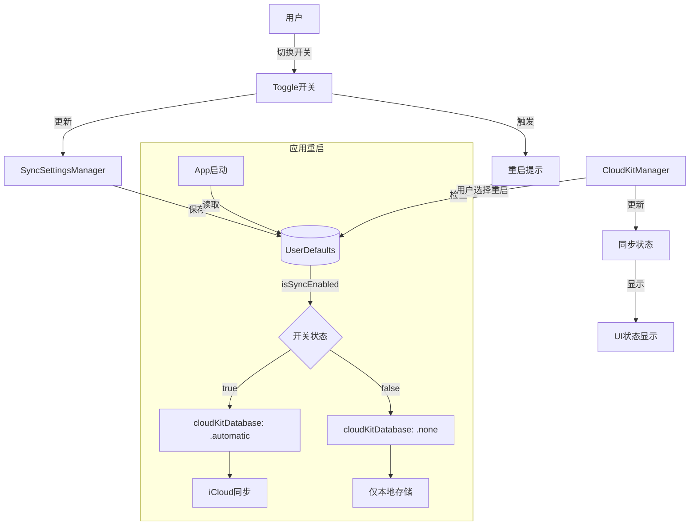

# iCloud同步功能开关实施总结

## 实施概述

为应用添加了iCloud同步开关控制功能，用户可以自主选择是否启用CloudKit同步。开关默认关闭，更改设置后需要重启应用才能生效。

**实施日期：** 2026-02-05  
**状态：** ✅ 代码实施完成，需要在Xcode中添加新文件

---

## 功能特性

### ✅ 已实现的功能

1. **同步开关管理**
   - 用户可以在设置页面控制同步开关
   - 开关状态持久化保存（UserDefaults）
   - 默认状态：关闭（首次安装）

2. **动态同步配置**
   - 应用启动时根据用户设置决定是否启用CloudKit
   - 关闭时：数据仅保存在本地（`cloudKitDatabase: .none`）
   - 开启时：数据自动同步到iCloud（`cloudKitDatabase: .automatic`）

3. **状态显示**
   - 同步已关闭：显示灰色 icloud.slash 图标
   - 未登录iCloud：显示橙色警告
   - 同步已启用：显示绿色对勾图标

4. **用户体验**
   - 切换开关时显示重启提示弹窗
   - 提供"稍后"和"立即重启"两个选项
   - 状态实时更新和刷新

---

## 技术实现

### 1. 新增文件

#### SyncSettingsManager.swift

**位置：** `migraine_note/migraine_note/Services/SyncSettingsManager.swift`

**职责：**
- 管理同步开关状态
- 使用 UserDefaults 持久化存储
- 提供单例访问和静态方法

**关键代码：**

```swift
@Observable
class SyncSettingsManager {
    var isSyncEnabled: Bool {
        didSet {
            UserDefaults.standard.set(isSyncEnabled, forKey: syncEnabledKey)
        }
    }
    
    static let syncEnabledKey = "icloud_sync_enabled"
    static let shared = SyncSettingsManager()
    
    static func isSyncCurrentlyEnabled() -> Bool {
        return UserDefaults.standard.bool(forKey: syncEnabledKey)
    }
}
```

### 2. 修改的文件

#### migraine_noteApp.swift

**修改内容：** 动态配置 ModelConfiguration

**修改前：**
```swift
let modelConfiguration = ModelConfiguration(
    schema: schema,
    isStoredInMemoryOnly: false,
    cloudKitDatabase: .automatic  // 硬编码
)
```

**修改后：**
```swift
// 根据用户设置决定是否启用iCloud同步
let syncEnabled = SyncSettingsManager.isSyncCurrentlyEnabled()

let modelConfiguration = ModelConfiguration(
    schema: schema,
    isStoredInMemoryOnly: false,
    cloudKitDatabase: syncEnabled ? .automatic : .none
)
```

#### CloudKitManager.swift

**修改内容：**
1. 新增 `.disabled` 同步状态
2. 在 `checkICloudStatus()` 中检查开关状态

**新增状态：**
```swift
enum SyncStatus {
    case disabled          // 同步已关闭
    // ...其他状态
    
    var displayText: String {
        case .disabled:
            return "同步已关闭"
        // ...
    }
    
    var icon: String {
        case .disabled:
            return "icloud.slash"
        // ...
    }
}
```

**状态检查逻辑：**
```swift
func checkICloudStatus() {
    // 首先检查用户是否启用了同步功能
    let syncEnabled = SyncSettingsManager.isSyncCurrentlyEnabled()
    
    if !syncEnabled {
        syncStatus = .disabled
        isICloudAvailable = false
        return
    }
    
    // 原有的iCloud检查逻辑...
}
```

#### SettingsView.swift (CloudSyncSettingsView)

**修改内容：**
1. 添加同步开关 Toggle
2. 添加重启提示 Alert
3. 更新状态显示逻辑

**新增UI组件：**

```swift
struct CloudSyncSettingsView: View {
    @State private var syncSettingsManager = SyncSettingsManager.shared
    @State private var showRestartAlert = false
    
    var body: some View {
        List {
            // 【新增】同步开关
            Section {
                Toggle(isOn: $syncSettingsManager.isSyncEnabled) {
                    VStack(alignment: .leading, spacing: 4) {
                        Text("启用iCloud同步")
                            .font(.body)
                        Text("关闭后数据仅保存在本地设备")
                            .font(.caption)
                            .foregroundColor(.secondary)
                    }
                }
                .tint(Color.accentPrimary)
            } footer: {
                Text("更改此设置后需要重启应用才能生效")
                    .font(.caption)
                    .foregroundColor(.orange)
            }
            
            // 原有的同步状态卡片...
        }
        .onChange(of: syncSettingsManager.isSyncEnabled) { oldValue, newValue in
            if oldValue != newValue {
                showRestartAlert = true
                cloudKitManager.checkICloudStatus()
            }
        }
        .alert("需要重启应用", isPresented: $showRestartAlert) {
            Button("稍后", role: .cancel) { }
            Button("立即重启") {
                exit(0)
            }
        } message: {
            Text("更改同步设置后需要重启应用才能生效。您可以稍后手动重启，或现在立即重启。")
        }
    }
}
```

---

## 数据流程图



---

## 用户界面

### 设置页面布局

```
iCloud同步
├── 【新增】启用iCloud同步开关
│   ├── Toggle开关
│   ├── 说明文字："关闭后数据仅保存在本地设备"
│   └── Footer："更改此设置后需要重启应用才能生效"
│
├── 同步状态卡片
│   ├── 图标（根据状态变化）
│   ├── 状态文本
│   └── 说明文字
│
├── 同步功能说明
├── 同步说明（特性列表）
└── 隐私保护说明
```

### 状态显示逻辑

| 开关状态 | iCloud登录 | 显示状态 | 图标 | 颜色 | 说明文字 |
|---------|-----------|---------|------|------|---------|
| 关闭 | - | 同步已关闭 | icloud.slash | 灰色 | 数据仅保存在本地设备 |
| 开启 | 未登录 | 未登录iCloud | exclamationmark.icloud | 橙色 | 请在系统设置中登录iCloud |
| 开启 | 已登录 | iCloud同步已启用 | checkmark.icloud.fill | 绿色 | 数据正在自动同步 |

---

## 测试场景

### 测试用例 1：关闭同步功能

1. 打开应用，进入设置 → iCloud同步
2. 关闭"启用iCloud同步"开关
3. 验证：显示重启提示弹窗
4. 选择"立即重启"或"稍后"
5. 重启应用后验证：
   - 同步状态显示"同步已关闭"
   - 图标为 icloud.slash（灰色）
   - 新建的数据不会上传到iCloud

### 测试用例 2：开启同步功能

1. 应用处于关闭同步状态
2. 进入设置 → iCloud同步
3. 开启"启用iCloud同步"开关
4. 验证：显示重启提示弹窗
5. 重启应用后验证：
   - 如已登录iCloud：显示"iCloud同步已启用"
   - 如未登录：显示"未登录iCloud"
   - 数据开始同步到iCloud

### 测试用例 3：首次安装

1. 全新安装应用
2. 进入设置 → iCloud同步
3. 验证：
   - 同步开关默认为关闭状态
   - 显示"同步已关闭"
   - 数据仅保存在本地

### 测试用例 4：重启提示交互

1. 切换同步开关
2. 验证弹窗显示：
   - 标题："需要重启应用"
   - 消息：说明需要重启的原因
   - 两个按钮："稍后"和"立即重启"
3. 选择"稍后"：弹窗关闭，开关状态已保存
4. 选择"立即重启"：应用退出

---

## 文件清单

### 新增文件
- ✅ `migraine_note/migraine_note/Services/SyncSettingsManager.swift`
- ✅ `docs/同步功能开关实施总结.md`（本文档）
- ✅ `docs/添加SyncSettingsManager到Xcode.md`（操作指南）

### 修改文件
- ✅ `migraine_note/migraine_note/migraine_noteApp.swift`
- ✅ `migraine_note/migraine_note/Services/CloudKitManager.swift`
- ✅ `migraine_note/migraine_note/Views/Settings/SettingsView.swift`

### 代码统计
- 新增代码行数：约 120 行
- 修改代码行数：约 80 行
- 新增文件数：1 个 Swift 文件
- 修改文件数：3 个 Swift 文件

---

## 下一步操作

### ⚠️ 必须完成的步骤

1. **在 Xcode 中添加新文件**
   - 将 `SyncSettingsManager.swift` 添加到项目
   - 详细步骤请参考：`docs/添加SyncSettingsManager到Xcode.md`
   - 文件已创建在：`migraine_note/migraine_note/Services/SyncSettingsManager.swift`

2. **构建和测试**
   - 在 Xcode 中按 `Cmd + B` 构建项目
   - 确保没有编译错误
   - 运行应用并测试同步开关功能

### 可选的优化

1. **数据迁移提示**
   - 对于升级的老用户，可以添加一次性引导提示
   - 说明新的同步开关功能

2. **同步状态增强**
   - 可以考虑添加手动同步按钮
   - 显示更详细的同步进度信息

3. **用户反馈**
   - 收集用户对同步开关功能的反馈
   - 根据使用情况优化交互流程

---

## 技术说明

### 为什么需要重启应用？

SwiftData 的 `ModelConfiguration` 在应用启动时配置，其 `cloudKitDatabase` 参数决定了整个数据容器的同步行为。这个配置一旦创建就无法在运行时修改，因此必须重启应用才能应用新的设置。

### 关闭同步后数据会怎样？

- **本地数据**：保持不变，继续可用
- **iCloud数据**：已同步的数据不会被删除，仍然保存在iCloud中
- **新建数据**：仅保存在本地设备，不会上传到iCloud
- **其他设备**：如果其他设备仍然开启同步，它们仍然可以访问和同步数据

### 重新开启同步后会发生什么？

当用户重新开启同步并重启应用后：
1. 应用会连接到iCloud
2. SwiftData 会自动处理数据合并
3. 本地在关闭期间创建的数据会上传到iCloud
4. iCloud上的新数据会下载到本地
5. 使用 Last Write Wins 策略解决冲突

---

## 注意事项

### 开发注意事项

1. **UserDefaults 键名**
   - 使用常量 `SyncSettingsManager.syncEnabledKey`
   - 值为 `"icloud_sync_enabled"`
   - 确保在其他地方也使用相同的键名

2. **状态一致性**
   - 开关状态变化时立即更新 CloudKitManager 状态
   - 确保UI显示与实际配置保持一致

3. **错误处理**
   - 当前实现假设 UserDefaults 操作总是成功
   - 生产环境可能需要添加错误处理

### 用户体验注意事项

1. **重启体验**
   - 使用 `exit(0)` 退出应用是简单但不够优雅的方式
   - iOS 不支持应用自我重启
   - 用户需要手动重新打开应用

2. **默认状态**
   - 首次安装时同步默认关闭
   - 这是一个保守的设计，让用户主动选择
   - 可以根据用户反馈调整默认行为

3. **状态提示**
   - 橙色 footer 提示用户需要重启
   - 切换开关时立即显示弹窗
   - 清晰告知用户操作结果

---

## 版本兼容性

- **最低版本要求**：iOS 17.0+（因为使用了 @Observable 和 SwiftData）
- **向后兼容**：已有用户升级后需要主动开启同步功能
- **数据兼容**：新旧版本的数据格式完全兼容

---

## 参考资料

### Apple 官方文档
- [SwiftData Configuration](https://developer.apple.com/documentation/swiftdata/modelconfiguration)
- [CloudKit Sync](https://developer.apple.com/documentation/cloudkit)
- [Observable Macro](https://developer.apple.com/documentation/observation/observable())

### 项目文档
- [CloudKit同步配置指南.md](./CloudKit同步配置指南.md)
- [技术架构文档.md](./技术架构文档.md)
- [添加SyncSettingsManager到Xcode.md](./添加SyncSettingsManager到Xcode.md)

---

## 变更日志

### 2026-02-05 - v1.0
- ✅ 实现同步开关管理器
- ✅ 动态配置 ModelConfiguration
- ✅ 增强 CloudKitManager 状态管理
- ✅ 更新设置UI添加开关和提示
- ✅ 创建实施文档和操作指南

---

## 作者信息

**实施日期**：2026年2月5日  
**实施者**：AI Assistant  
**审核状态**：待测试  
**文档版本**：1.0
