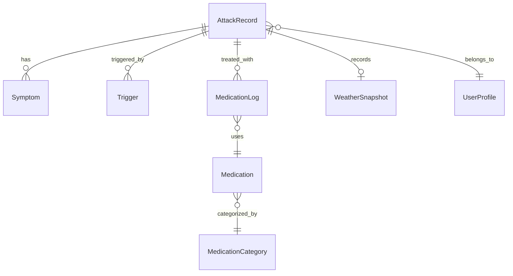

# 偏头痛记录App - 技术架构文档

**版本**: 1.0  
**最后更新**: 2026年2月1日  
**目标平台**: iOS 17.0+  
**开发语言**: Swift 5.9+  
**架构模式**: MVVM + SwiftData

---

## 目录

1. [项目概述](#1-项目概述)
2. [技术栈选型](#2-技术栈选型)
3. [核心数据架构](#3-核心数据架构)
4. [Apple框架集成](#4-apple框架集成)
5. [功能模块架构](#5-功能模块架构)
6. [数据分析与算法](#6-数据分析与算法)
7. [PDF报告生成](#7-pdf报告生成)
8. [性能优化与安全](#8-性能优化与安全)
9. [测试策略](#9-测试策略)
10. [开发路线图](#10-开发路线图)

---

## 1. 项目概述

### 1.1 项目简介

偏头痛记录App是一款基于iOS原生生态的医疗级健康记录应用，旨在帮助偏头痛患者：
- 精确记录发作信息（时间、疼痛强度、部位、症状）
- 追踪诱因（饮食、环境、生活方式）
- 管理用药并预防药物过度使用（MOH）
- 生成专业医疗报告供医生诊断参考
- 整合中医证候分析，提供本地化健康建议

### 1.2 核心设计原则

- **隐私至上**: 所有数据存储在用户的iCloud私有数据库，开发者无法访问
- **零第三方依赖**: 完全基于Apple原生框架，无需第三方SDK
- **医疗级标准**: 遵循IHS ICHD-3标准和《中国偏头痛诊断与治疗指南（2024版）》
- **患者友好**: 暗黑模式优先，极简操作流程

### 1.3 技术目标

- 支持iPhone和iPad（Universal App）
- 利用iCloud实现多设备无缝同步
- 与Apple Health深度整合
- 高性能的数据查询和可视化
- 符合医疗数据安全标准

---

## 2. 技术栈选型

### 2.1 核心技术栈

| 技术领域 | 选型 | 版本要求 | 说明 |
|---------|------|---------|------|
| **UI框架** | SwiftUI | iOS 17.0+ | 声明式UI，现代化开发体验 |
| **数据持久化** | SwiftData | iOS 17.0+ | 新一代数据框架，简化Core Data |
| **云同步** | CloudKit | iOS 17.0+ | iCloud私有数据库同步 |
| **健康数据** | HealthKit | iOS 17.0+ | 读写健康数据 |
| **天气数据** | WeatherKit | iOS 17.0+ | 精准气象数据 |
| **图表** | Swift Charts | iOS 17.0+ | 原生数据可视化 |
| **PDF生成** | PDFKit | iOS 17.0+ | 医疗报告导出 |
| **临床研究** | ResearchKit | 最新版 | 标准化问卷 |
| **护理管理** | CareKit | 最新版 | 用药管理 |

### 2.2 SwiftUI + SwiftData 架构优势

```mermaid
graph TB
    SwiftUI[SwiftUI Views] -->|@Query| SwiftData[SwiftData Models]
    SwiftUI -->|@Observable| ViewModels[ViewModels]
    SwiftData -->|自动同步| CloudKit[CloudKit Private DB]
    ViewModels -->|业务逻辑| Services[Service Layer]
    Services -->|集成| HealthKit[HealthKit]
    Services -->|集成| WeatherKit[WeatherKit]
```

**选择理由**:
1. **SwiftData**: 相比Core Data，代码量减少60%，类型安全，编译时检查
2. **CloudKit自动集成**: 通过`@Model`宏自动实现iCloud同步
3. **SwiftUI原生支持**: `@Query`宏提供响应式数据绑定
4. **现代化异步**: 完整的async/await支持

---

## 3. 核心数据架构

### 3.1 SwiftData模型设计

#### 3.1.1 实体关系图（ERD）



#### 3.1.2 AttackRecord（发作记录）

```swift
import SwiftData
import Foundation

@Model
final class AttackRecord {
    // 主键
    @Attribute(.unique) var id: UUID
    
    // 时间信息
    var startTime: Date
    var endTime: Date?
    
    // 疼痛评估
    var painIntensity: Int // 0-10 VAS评分
    var painLocation: [String] // ["left_temple", "right_temple", "forehead"]
    var painQuality: [PainQuality] // 疼痛性质
    
    // 先兆
    var hasAura: Bool
    var auraTypes: [AuraType]
    var auraDuration: TimeInterval? // 分钟
    
    // 关系
    @Relationship(deleteRule: .cascade) var symptoms: [Symptom]
    @Relationship(deleteRule: .cascade) var triggers: [Trigger]
    @Relationship(deleteRule: .cascade) var medications: [MedicationLog]
    @Relationship(deleteRule: .cascade) var weatherSnapshot: WeatherSnapshot?
    
    // 生理数据（来自HealthKit）
    var menstrualDay: Int? // 月经周期第几天
    var sleepHours: Double? // 前一晚睡眠时长
    var averageHeartRate: Double? // 发作时平均心率
    
    // 元数据
    var notes: String?
    var createdAt: Date
    var updatedAt: Date
    
    // 中医相关
    var tcmPattern: [TCMPattern] // 中医证候
    
    init(startTime: Date = Date()) {
        self.id = UUID()
        self.startTime = startTime
        self.painIntensity = 0
        self.painLocation = []
        self.painQuality = []
        self.hasAura = false
        self.auraTypes = []
        self.symptoms = []
        self.triggers = []
        self.medications = []
        self.tcmPattern = []
        self.createdAt = Date()
        self.updatedAt = Date()
    }
    
    // 计算属性
    var duration: TimeInterval? {
        guard let endTime = endTime else { return nil }
        return endTime.timeIntervalSince(startTime)
    }
    
    var isOngoing: Bool {
        return endTime == nil
    }
}

// 枚举类型
enum PainQuality: String, Codable {
    case pulsating = "搏动性"
    case pressing = "压迫感"
    case stabbing = "刺痛"
    case dull = "钝痛"
    case distending = "胀痛" // 中医
}

enum AuraType: String, Codable {
    case visualFlashes = "视觉闪光"
    case visualScotoma = "视野暗点"
    case sensoryNumbness = "肢体麻木"
    case speechDifficulty = "言语障碍"
}

enum TCMPattern: String, Codable {
    case windCold = "风寒侵袭"
    case dampness = "湿邪困阻"
    case liveQiStagnation = "肝气郁结"
    case liverFire = "肝火上炎"
    case qiBloodDeficiency = "气血亏虚"
    case dampHeat = "湿热内蕴"
}
```

#### 3.1.3 Symptom（症状）

```swift
@Model
final class Symptom {
    @Attribute(.unique) var id: UUID
    var type: SymptomType
    var severity: Int // 1-5
    var onset: Date
    var notes: String?
    
    init(type: SymptomType, severity: Int = 3) {
        self.id = UUID()
        self.type = type
        self.severity = severity
        self.onset = Date()
    }
}

enum SymptomType: String, Codable, CaseIterable {
    // IHS标准症状
    case nausea = "恶心"
    case vomiting = "呕吐"
    case photophobia = "畏光"
    case phonophobia = "畏声"
    case osmophobia = "气味敏感"
    case allodynia = "头皮触痛"
    
    // 中医特有症状
    case bitterTaste = "口苦"
    case facialFlushing = "面红目赤"
    case coldExtremities = "手脚冰凉"
    case heavyHeadedness = "头重如裹"
    case dizziness = "眩晕"
    case palpitation = "心悸"
}
```

#### 3.1.4 Trigger（诱因）

```swift
@Model
final class Trigger {
    @Attribute(.unique) var id: UUID
    var category: TriggerCategory
    var specificType: String // 具体诱因名称
    var confidence: Double // 0.0-1.0 用户确定程度
    var notes: String?
    var timestamp: Date
    
    init(category: TriggerCategory, specificType: String) {
        self.id = UUID()
        self.category = category
        self.specificType = specificType
        self.confidence = 1.0
        self.timestamp = Date()
    }
}

enum TriggerCategory: String, Codable, CaseIterable {
    case food = "饮食"
    case environment = "环境"
    case sleep = "睡眠"
    case stress = "压力"
    case hormone = "激素"
    case lifestyle = "生活方式"
    case tcm = "中医诱因"
}

// 预定义诱因库
struct TriggerLibrary {
    static let foodTriggers = [
        "味精(MSG)", "巧克力", "奶酪", "红酒", "咖啡因",
        "老火汤/高汤", "腌制/腊肉", "冰饮/冷食", "辛辣食物"
    ]
    
    static let environmentTriggers = [
        "闷热/雷雨前", "冷风直吹", "强光", "异味", "高海拔",
        "气压骤降", "高温", "高湿度"
    ]
    
    static let sleepTriggers = [
        "睡过头", "失眠/熬夜", "睡眠不足", "睡眠质量差"
    ]
    
    static let stressTriggers = [
        "工作压力", "情绪激动", "焦虑", "周末放松(Let-down)"
    ]
}
```

#### 3.1.5 MedicationLog（用药记录）

```swift
@Model
final class MedicationLog {
    @Attribute(.unique) var id: UUID
    var medication: Medication?
    var dosage: Double // mg
    var timeTaken: Date
    var efficacy: MedicationEfficacy
    var efficacyCheckedAt: Date?
    var sideEffects: [String]
    
    init(dosage: Double, timeTaken: Date = Date()) {
        self.id = UUID()
        self.dosage = dosage
        self.timeTaken = timeTaken
        self.efficacy = .notEvaluated
        self.sideEffects = []
    }
    
    // 是否需要评估疗效（服药2小时后）
    var needsEfficacyEvaluation: Bool {
        guard efficacy == .notEvaluated else { return false }
        return Date().timeIntervalSince(timeTaken) >= 7200 // 2小时
    }
}

enum MedicationEfficacy: String, Codable {
    case notEvaluated = "未评估"
    case complete = "完全缓解"
    case partial = "部分缓解"
    case noEffect = "无效"
}

@Model
final class Medication {
    @Attribute(.unique) var id: UUID
    var name: String
    var category: MedicationCategory
    var standardDosage: Double
    var unit: String // "mg", "片"
    var isAcute: Bool // true=急性用药, false=预防性用药
    var monthlyLimit: Int? // MOH阈值（天数）
    var inventory: Int // 库存数量
    var notes: String?
    
    init(name: String, category: MedicationCategory, isAcute: Bool) {
        self.id = UUID()
        self.name = name
        self.category = category
        self.standardDosage = 0
        self.unit = "mg"
        self.isAcute = isAcute
        self.inventory = 0
    }
}

enum MedicationCategory: String, Codable, CaseIterable {
    case nsaid = "非甾体抗炎药(NSAID)"
    case triptan = "曲普坦类"
    case opioid = "阿片类"
    case ergotamine = "麦角胺类"
    case preventive = "预防性药物"
    case tcmHerbal = "中成药"
    case other = "其他"
}
```

#### 3.1.6 WeatherSnapshot（气象快照）

```swift
@Model
final class WeatherSnapshot {
    @Attribute(.unique) var id: UUID
    var timestamp: Date
    var pressure: Double // hPa
    var pressureTrend: PressureTrend
    var temperature: Double // 摄氏度
    var humidity: Double // 百分比
    var windSpeed: Double // km/h
    var condition: String // "晴", "阴", "雨"
    var location: String
    
    init(timestamp: Date = Date()) {
        self.id = UUID()
        self.timestamp = timestamp
        self.pressure = 0
        self.pressureTrend = .steady
        self.temperature = 0
        self.humidity = 0
        self.windSpeed = 0
        self.condition = ""
        self.location = ""
    }
}

enum PressureTrend: String, Codable {
    case rising = "上升"
    case falling = "下降"
    case steady = "稳定"
}
```

#### 3.1.7 UserProfile（用户配置）

```swift
@Model
final class UserProfile {
    @Attribute(.unique) var id: UUID
    var name: String?
    var age: Int?
    var gender: Gender?
    
    // 病史
    var migraineOnsetAge: Int? // 发病年龄
    var familyHistory: Bool // 家族史
    
    // 偏好设置
    var enableTCMFeatures: Bool // 启用中医功能
    var enableHealthKitSync: Bool
    var enableWeatherTracking: Bool
    var preferredPainScale: PainScale
    
    // 提醒设置
    var medicationReminders: [MedicationReminder]
    var efficacyCheckReminder: Bool
    
    // 隐私设置
    var requireBiometricAuth: Bool
    
    init() {
        self.id = UUID()
        self.familyHistory = false
        self.enableTCMFeatures = true
        self.enableHealthKitSync = true
        self.enableWeatherTracking = true
        self.preferredPainScale = .numeric
        self.medicationReminders = []
        self.efficacyCheckReminder = true
        self.requireBiometricAuth = false
    }
}

enum Gender: String, Codable {
    case male = "男"
    case female = "女"
    case other = "其他"
}

enum PainScale: String, Codable {
    case numeric = "数字评分(NRS)"
    case visual = "视觉模拟(VAS)"
}

struct MedicationReminder: Codable {
    var medicationName: String
    var time: Date
    var repeatDaily: Bool
}
```

### 3.2 CloudKit 同步配置

#### 3.2.1 启用CloudKit同步

```swift
// migraine_noteApp.swift
import SwiftUI
import SwiftData

@main
struct MigraineNoteApp: App {
    var body: some Scene {
        WindowGroup {
            ContentView()
        }
        .modelContainer(for: [
            AttackRecord.self,
            Symptom.self,
            Trigger.self,
            MedicationLog.self,
            Medication.self,
            WeatherSnapshot.self,
            UserProfile.self
        ], 
        // 启用iCloud同步
        isStoredInMemoryOnly: false,
        isAutosaveEnabled: true
        ) { error in
            print("Failed to initialize model container: \(error)")
        }
    }
}
```

#### 3.2.2 配置CloudKit Capability

**Xcode配置步骤**:
1. 选择Target → Signing & Capabilities
2. 添加iCloud Capability
3. 勾选CloudKit
4. 添加Container: `iCloud.com.yourteam.migraine-note`
5. 添加Background Modes → Remote notifications

**entitlements配置**:
```xml
<!-- migraine_note.entitlements -->
<dict>
    <key>com.apple.developer.icloud-container-identifiers</key>
    <array>
        <string>iCloud.com.yourteam.migraine-note</string>
    </array>
    <key>com.apple.developer.icloud-services</key>
    <array>
        <string>CloudKit</string>
    </array>
    <key>com.apple.developer.ubiquity-container-identifiers</key>
    <array>
        <string>iCloud.com.yourteam.migraine-note</string>
    </array>
</dict>
```

#### 3.2.3 数据隐私策略

- **私有数据库**: 所有用户数据存储在`CKContainer.default().privateCloudDatabase`
- **端到端加密**: 用户数据在传输和静态存储时均加密
- **开发者零访问**: 开发者无法访问用户的CloudKit私有数据库
- **自动冲突解决**: SwiftData自动处理多设备同步冲突

---

## 4. Apple框架集成

### 4.1 HealthKit集成

#### 4.1.1 权限配置

**Info.plist添加**:
```xml
<key>NSHealthShareUsageDescription</key>
<string>我们需要读取您的睡眠、月经周期和心率数据，以分析偏头痛诱因</string>
<key>NSHealthUpdateUsageDescription</key>
<string>我们将头痛记录同步到健康App，便于统一管理您的健康数据</string>
```

**Capability配置**:
- 添加HealthKit Capability
- 勾选Clinical Health Records（可选）

#### 4.1.2 HealthKit Manager实现

```swift
import HealthKit

@Observable
class HealthKitManager {
    private let healthStore = HKHealthStore()
    var isAuthorized = false
    
    // 需要读取的数据类型
    private let readTypes: Set<HKObjectType> = [
        HKObjectType.categoryType(forIdentifier: .sleepAnalysis)!,
        HKObjectType.categoryType(forIdentifier: .menstrualFlow)!,
        HKObjectType.quantityType(forIdentifier: .heartRate)!,
        HKObjectType.quantityType(forIdentifier: .restingHeartRate)!
    ]
    
    // 需要写入的数据类型
    private let writeTypes: Set<HKSampleType> = [
        HKObjectType.categoryType(forIdentifier: .headache)!
    ]
    
    // 请求授权
    func requestAuthorization() async throws {
        try await healthStore.requestAuthorization(
            toShare: writeTypes,
            read: readTypes
        )
        isAuthorized = true
    }
    
    // 写入头痛记录
    func saveHeadache(attack: AttackRecord) async throws {
        guard let headacheType = HKObjectType.categoryType(forIdentifier: .headache) else {
            throw HealthKitError.invalidType
        }
        
        // 映射疼痛强度到HealthKit标准
        let severity: HKCategoryValueSeverity = {
            switch attack.painIntensity {
            case 0: return .notPresent
            case 1...3: return .mild
            case 4...6: return .moderate
            case 7...10: return .severe
            default: return .unspecified
            }
        }()
        
        // 构建元数据
        var metadata: [String: Any] = [
            HKMetadataKeyHeadacheSeverity: severity.rawValue
        ]
        
        if attack.hasAura {
            metadata["HasAura"] = true
        }
        
        if !attack.painLocation.isEmpty {
            metadata["PainLocation"] = attack.painLocation.joined(separator: ",")
        }
        
        // 创建样本
        let endTime = attack.endTime ?? Date()
        let sample = HKCategorySample(
            type: headacheType,
            value: HKCategoryValue.notApplicable.rawValue,
            start: attack.startTime,
            end: endTime,
            metadata: metadata
        )
        
        try await healthStore.save(sample)
    }
    
    // 读取睡眠数据
    func fetchSleepData(for date: Date) async throws -> Double? {
        guard let sleepType = HKObjectType.categoryType(forIdentifier: .sleepAnalysis) else {
            return nil
        }
        
        let calendar = Calendar.current
        let startOfDay = calendar.startOfDay(for: date)
        let endOfDay = calendar.date(byAdding: .day, value: 1, to: startOfDay)!
        
        let predicate = HKQuery.predicateForSamples(
            withStart: startOfDay,
            end: endOfDay,
            options: .strictStartDate
        )
        
        return try await withCheckedThrowingContinuation { continuation in
            let query = HKSampleQuery(
                sampleType: sleepType,
                predicate: predicate,
                limit: HKObjectQueryNoLimit,
                sortDescriptors: [NSSortDescriptor(key: HKSampleSortIdentifierStartDate, ascending: true)]
            ) { _, samples, error in
                if let error = error {
                    continuation.resume(throwing: error)
                    return
                }
                
                guard let sleepSamples = samples as? [HKCategorySample] else {
                    continuation.resume(returning: nil)
                    return
                }
                
                // 计算总睡眠时长（仅统计asleep状态）
                let totalSleep = sleepSamples
                    .filter { $0.value == HKCategoryValueSleepAnalysis.asleep.rawValue }
                    .reduce(0.0) { total, sample in
                        total + sample.endDate.timeIntervalSince(sample.startDate)
                    }
                
                continuation.resume(returning: totalSleep / 3600.0) // 转换为小时
            }
            
            healthStore.execute(query)
        }
    }
    
    // 读取月经周期数据
    func fetchMenstrualCycleDay(for date: Date) async throws -> Int? {
        guard let menstrualType = HKObjectType.categoryType(forIdentifier: .menstrualFlow) else {
            return nil
        }
        
        // 查找最近的月经开始日期
        let predicate = HKQuery.predicateForSamples(
            withStart: Calendar.current.date(byAdding: .day, value: -35, to: date),
            end: date,
            options: .strictEndDate
        )
        
        return try await withCheckedThrowingContinuation { continuation in
            let query = HKSampleQuery(
                sampleType: menstrualType,
                predicate: predicate,
                limit: HKObjectQueryNoLimit,
                sortDescriptors: [NSSortDescriptor(key: HKSampleSortIdentifierStartDate, ascending: false)]
            ) { _, samples, error in
                if let error = error {
                    continuation.resume(throwing: error)
                    return
                }
                
                guard let menstrualSamples = samples as? [HKCategorySample],
                      let firstFlow = menstrualSamples.first(where: { 
                          $0.value != HKCategoryValueMenstrualFlow.none.rawValue 
                      }) else {
                    continuation.resume(returning: nil)
                    return
                }
                
                let daysSinceStart = Calendar.current.dateComponents(
                    [.day],
                    from: firstFlow.startDate,
                    to: date
                ).day ?? 0
                
                continuation.resume(returning: daysSinceStart + 1)
            }
            
            healthStore.execute(query)
        }
    }
}

enum HealthKitError: Error {
    case invalidType
    case notAuthorized
}
```

### 4.2 WeatherKit集成

#### 4.2.1 配置WeatherKit

**Xcode配置**:
1. 登录Apple Developer账号
2. 获取WeatherKit服务密钥
3. 添加WeatherKit Capability

**Info.plist**:
```xml
<key>NSLocationWhenInUseUsageDescription</key>
<string>我们需要您的位置信息来记录当地天气状况，帮助分析环境诱因</string>
```

#### 4.2.2 WeatherKit Manager实现

```swift
import WeatherKit
import CoreLocation

@Observable
class WeatherManager {
    private let weatherService = WeatherService.shared
    private let locationManager = CLLocationManager()
    
    var currentLocation: CLLocation?
    var isAuthorized = false
    
    func requestLocationAuthorization() {
        locationManager.requestWhenInUseAuthorization()
    }
    
    // 获取当前天气快照
    func fetchCurrentWeather() async throws -> WeatherSnapshot {
        guard let location = currentLocation else {
            throw WeatherError.locationNotAvailable
        }
        
        let weather = try await weatherService.weather(for: location)
        
        return WeatherSnapshot(
            timestamp: Date(),
            pressure: weather.currentWeather.pressure.value,
            pressureTrend: determinePressureTrend(weather),
            temperature: weather.currentWeather.temperature.value,
            humidity: weather.currentWeather.humidity,
            windSpeed: weather.currentWeather.wind.speed.value,
            condition: weather.currentWeather.condition.description,
            location: await reverseGeocode(location)
        )
    }
    
    // 获取历史天气数据
    func fetchHistoricalWeather(
        for date: Date,
        at location: CLLocation
    ) async throws -> WeatherSnapshot {
        // WeatherKit支持过去10天的历史数据
        let dayWeather = try await weatherService.weather(
            for: location,
            including: .daily(startDate: date, endDate: date)
        )
        
        guard let historicalDay = dayWeather.first else {
            throw WeatherError.dataNotAvailable
        }
        
        return WeatherSnapshot(
            timestamp: date,
            pressure: historicalDay.highTemperature.value, // 注：WeatherKit历史数据有限
            pressureTrend: .steady,
            temperature: historicalDay.highTemperature.value,
            humidity: 0, // 历史数据可能不完整
            windSpeed: historicalDay.wind.speed?.value ?? 0,
            condition: historicalDay.condition.description,
            location: await reverseGeocode(location)
        )
    }
    
    // 判断气压趋势
    private func determinePressureTrend(_ weather: Weather) -> PressureTrend {
        // 可以通过比较hourlyForecast的气压变化判断
        let hourlyPressures = weather.hourlyForecast.forecast.prefix(3).map { $0.pressure.value }
        
        guard hourlyPressures.count >= 2 else { return .steady }
        
        let change = hourlyPressures.last! - hourlyPressures.first!
        
        if change > 2 { return .rising }
        else if change < -2 { return .falling }
        else { return .steady }
    }
    
    // 反向地理编码
    private func reverseGeocode(_ location: CLLocation) async -> String {
        let geocoder = CLGeocoder()
        do {
            let placemarks = try await geocoder.reverseGeocodeLocation(location)
            return placemarks.first?.locality ?? "未知位置"
        } catch {
            return "未知位置"
        }
    }
}

enum WeatherError: Error {
    case locationNotAvailable
    case dataNotAvailable
}
```

### 4.3 ResearchKit集成

用于构建标准化的发作记录问卷。

```swift
import ResearchKit

class AttackSurveyBuilder {
    static func createAttackSurvey() -> ORKOrderedTask {
        var steps: [ORKStep] = []
        
        // Step 1: 疼痛强度（VAS）
        let painScale = ORKScaleAnswerFormat(
            maximumValue: 10,
            minimumValue: 0,
            defaultValue: 5,
            step: 1,
            vertical: false,
            maximumValueDescription: "剧痛",
            minimumValueDescription: "无痛"
        )
        
        let painQuestion = ORKQuestionStep(
            identifier: "painIntensity",
            title: "疼痛强度",
            question: "请评估您当前的疼痛程度",
            answer: painScale
        )
        steps.append(painQuestion)
        
        // Step 2: 疼痛性质
        let painQualities = [
            ORKTextChoice(text: "搏动性（跳痛）", value: "pulsating" as NSString),
            ORKTextChoice(text: "压迫感（紧箍感）", value: "pressing" as NSString),
            ORKTextChoice(text: "刺痛", value: "stabbing" as NSString),
            ORKTextChoice(text: "钝痛", value: "dull" as NSString),
            ORKTextChoice(text: "胀痛", value: "distending" as NSString)
        ]
        
        let painQualityFormat = ORKAnswerFormat.choiceAnswerFormat(
            with: .multipleChoice,
            textChoices: painQualities
        )
        
        let painQualityQuestion = ORKQuestionStep(
            identifier: "painQuality",
            title: "疼痛性质",
            question: "请选择疼痛的特征（可多选）",
            answer: painQualityFormat
        )
        steps.append(painQualityQuestion)
        
        // Step 3: 伴随症状
        let symptoms = [
            ORKTextChoice(text: "恶心", value: "nausea" as NSString),
            ORKTextChoice(text: "呕吐", value: "vomiting" as NSString),
            ORKTextChoice(text: "畏光", value: "photophobia" as NSString),
            ORKTextChoice(text: "畏声", value: "phonophobia" as NSString)
        ]
        
        let symptomFormat = ORKAnswerFormat.choiceAnswerFormat(
            with: .multipleChoice,
            textChoices: symptoms
        )
        
        let symptomQuestion = ORKQuestionStep(
            identifier: "symptoms",
            title: "伴随症状",
            question: "您是否有以下症状？",
            answer: symptomFormat
        )
        steps.append(symptomQuestion)
        
        return ORKOrderedTask(identifier: "attackSurvey", steps: steps)
    }
}
```

### 4.4 CareKit集成

用于预防性用药管理。

```swift
import CareKit

class MedicationCareManager {
    static func createPreventiveMedicationTask(
        medication: Medication
    ) -> OCKTask {
        // 创建每日用药任务
        let schedule = OCKSchedule.dailyAtTime(
            hour: 20, // 晚上8点
            minutes: 0,
            start: Date(),
            end: nil,
            text: "每晚服用"
        )
        
        var task = OCKTask(
            id: "preventive-\(medication.id)",
            title: "预防性用药",
            carePlanUUID: nil,
            schedule: schedule
        )
        
        task.instructions = "服用 \(medication.name) \(medication.standardDosage)\(medication.unit)"
        
        return task
    }
}
```

---

## 5. 功能模块架构

### 5.1 MVVM架构设计

```mermaid
graph TB
    subgraph Views[SwiftUI Views]
        HomeView[HomeView]
        RecordingView[RecordingView]
        AnalyticsView[AnalyticsView]
        CalendarView[CalendarView]
    end
    
    subgraph ViewModels[ViewModels]
        HomeVM[HomeViewModel]
        RecordingVM[RecordingViewModel]
        AnalyticsVM[AnalyticsViewModel]
        CalendarVM[CalendarViewModel]
    end
    
    subgraph Models[SwiftData Models]
        AttackRecord
        Medication
        Trigger
    end
    
    subgraph Services[Services]
        HealthKitManager
        WeatherManager
        AnalyticsEngine
        PDFGenerator
    end
    
    Views -->|@Observable| ViewModels
    ViewModels -->|@Query| Models
    ViewModels --> Services
```

### 5.2 核心ViewModel实现

#### 5.2.1 RecordingViewModel

```swift
import SwiftUI
import SwiftData

@Observable
class RecordingViewModel {
    var currentAttack: AttackRecord?
    var currentStep: RecordingStep = .timeAndDuration
    
    // 临时数据
    var selectedPainIntensity: Int = 0
    var selectedPainLocations: Set<String> = []
    var selectedSymptoms: Set<SymptomType> = []
    var selectedTriggers: Set<String> = []
    
    private let modelContext: ModelContext
    private let healthKitManager: HealthKitManager
    private let weatherManager: WeatherManager
    
    init(
        modelContext: ModelContext,
        healthKitManager: HealthKitManager,
        weatherManager: WeatherManager
    ) {
        self.modelContext = modelContext
        self.healthKitManager = healthKitManager
        self.weatherManager = weatherManager
    }
    
    // 开始记录
    func startRecording() async {
        let attack = AttackRecord(startTime: Date())
        
        // 获取天气数据
        if let weather = try? await weatherManager.fetchCurrentWeather() {
            attack.weatherSnapshot = weather
            modelContext.insert(weather)
        }
        
        // 获取HealthKit数据
        if let sleepHours = try? await healthKitManager.fetchSleepData(for: Date()) {
            attack.sleepHours = sleepHours
        }
        
        if let menstrualDay = try? await healthKitManager.fetchMenstrualCycleDay(for: Date()) {
            attack.menstrualDay = menstrualDay
        }
        
        modelContext.insert(attack)
        currentAttack = attack
    }
    
    // 保存记录
    func saveRecording() async throws {
        guard let attack = currentAttack else { return }
        
        attack.painIntensity = selectedPainIntensity
        attack.painLocation = Array(selectedPainLocations)
        
        // 添加症状
        for symptomType in selectedSymptoms {
            let symptom = Symptom(type: symptomType)
            attack.symptoms.append(symptom)
            modelContext.insert(symptom)
        }
        
        // 添加诱因
        for triggerName in selectedTriggers {
            let trigger = Trigger(category: .food, specificType: triggerName)
            attack.triggers.append(trigger)
            modelContext.insert(trigger)
        }
        
        attack.updatedAt = Date()
        
        try modelContext.save()
        
        // 同步到HealthKit
        try await healthKitManager.saveHeadache(attack: attack)
        
        // 重置状态
        reset()
    }
    
    func nextStep() {
        currentStep = currentStep.next()
    }
    
    func previousStep() {
        currentStep = currentStep.previous()
    }
    
    private func reset() {
        currentAttack = nil
        currentStep = .timeAndDuration
        selectedPainIntensity = 0
        selectedPainLocations = []
        selectedSymptoms = []
        selectedTriggers = []
    }
}

enum RecordingStep: Int, CaseIterable {
    case timeAndDuration = 0
    case painAssessment
    case symptoms
    case triggers
    case interventions
    
    func next() -> RecordingStep {
        RecordingStep(rawValue: self.rawValue + 1) ?? .interventions
    }
    
    func previous() -> RecordingStep {
        RecordingStep(rawValue: self.rawValue - 1) ?? .timeAndDuration
    }
}
```

### 5.3 服务层架构

#### 5.3.1 AnalyticsEngine（数据分析引擎）

```swift
import SwiftData
import Foundation

class AnalyticsEngine {
    private let modelContext: ModelContext
    
    init(modelContext: ModelContext) {
        self.modelContext = modelContext
    }
    
    // 计算月度统计
    func calculateMonthlyStats(for month: Date) throws -> MonthlyStats {
        let calendar = Calendar.current
        let startOfMonth = calendar.date(from: calendar.dateComponents([.year, .month], from: month))!
        let endOfMonth = calendar.date(byAdding: .month, value: 1, to: startOfMonth)!
        
        let descriptor = FetchDescriptor<AttackRecord>(
            predicate: #Predicate { attack in
                attack.startTime >= startOfMonth && attack.startTime < endOfMonth
            }
        )
        
        let attacks = try modelContext.fetch(descriptor)
        
        let totalDays = attacks.count
        let averagePain = attacks.reduce(0.0) { $0 + Double($1.painIntensity) } / Double(attacks.count)
        
        // 计算用药天数
        let medicationDays = Set(attacks.filter { !$0.medications.isEmpty }
            .map { Calendar.current.startOfDay(for: $0.startTime) }
        ).count
        
        return MonthlyStats(
            totalAttacks: totalDays,
            averagePainIntensity: averagePain,
            medicationDays: medicationDays,
            mohRisk: medicationDays > 10
        )
    }
    
    // 诱因频次分析
    func analyzeTriggerFrequency() throws -> [TriggerFrequency] {
        let descriptor = FetchDescriptor<AttackRecord>()
        let attacks = try modelContext.fetch(descriptor)
        
        var triggerCounts: [String: Int] = [:]
        
        for attack in attacks {
            for trigger in attack.triggers {
                triggerCounts[trigger.specificType, default: 0] += 1
            }
        }
        
        return triggerCounts.map { name, count in
            TriggerFrequency(
                name: name,
                count: count,
                percentage: Double(count) / Double(attacks.count) * 100
            )
        }.sorted { $0.count > $1.count }
    }
}

struct MonthlyStats {
    let totalAttacks: Int
    let averagePainIntensity: Double
    let medicationDays: Int
    let mohRisk: Bool
}

struct TriggerFrequency {
    let name: String
    let count: Int
    let percentage: Double
}
```

---

## 6. 数据分析与算法

### 6.1 MOH（药物过度使用头痛）预警算法

```swift
class MOHDetector {
    // MOH诊断标准（基于《中国偏头痛诊断与治疗指南2024》）
    static func checkMOHRisk(
        for period: DateInterval,
        attacks: [AttackRecord]
    ) -> MOHRiskLevel {
        let medicationDays = calculateMedicationDays(in: period, attacks: attacks)
        
        // 统计不同类型药物的使用天数
        var nsaidDays = 0
        var triptanDays = 0
        var opioidDays = 0
        
        for attack in attacks {
            let dayStart = Calendar.current.startOfDay(for: attack.startTime)
            
            for medLog in attack.medications {
                guard let medication = medLog.medication else { continue }
                
                switch medication.category {
                case .nsaid:
                    if !medicationDaysSet.contains(where: { Calendar.current.isDate($0, inSameDayAs: dayStart) }) {
                        nsaidDays += 1
                    }
                case .triptan, .ergotamine:
                    triptanDays += 1
                case .opioid:
                    opioidDays += 1
                default:
                    break
                }
            }
        }
        
        // 判断风险等级
        if nsaidDays >= 15 || triptanDays >= 10 || opioidDays >= 10 {
            return .high
        } else if nsaidDays >= 12 || triptanDays >= 8 || opioidDays >= 8 {
            return .medium
        } else if nsaidDays >= 10 || triptanDays >= 6 || opioidDays >= 6 {
            return .low
        } else {
            return .none
        }
    }
    
    private static func calculateMedicationDays(
        in period: DateInterval,
        attacks: [AttackRecord]
    ) -> Int {
        let medicationDays = Set(
            attacks
                .filter { !$0.medications.isEmpty }
                .map { Calendar.current.startOfDay(for: $0.startTime) }
                .filter { period.contains($0) }
        )
        
        return medicationDays.count
    }
}

enum MOHRiskLevel {
    case none
    case low
    case medium
    case high
    
    var description: String {
        switch self {
        case .none: return "用药频率正常"
        case .low: return "注意控制用药频率"
        case .medium: return "用药过于频繁，请咨询医生"
        case .high: return "高风险！可能存在药物过度使用性头痛"
        }
    }
}
```

### 6.2 中医证候识别算法

```swift
class TCMPatternAnalyzer {
    // 基于症状和诱因推断中医证候
    static func inferPatterns(from attack: AttackRecord) -> [TCMPattern] {
        var patterns: [TCMPattern] = []
        var scores: [TCMPattern: Double] = [:]
        
        // 风寒特征
        if attack.triggers.contains(where: { $0.specificType.contains("吹风") || $0.specificType.contains("受凉") }),
           attack.symptoms.contains(where: { $0.type == .coldExtremities }) {
            scores[.windCold] = (scores[.windCold] ?? 0) + 2.0
        }
        
        // 湿邪特征
        if let weather = attack.weatherSnapshot,
           weather.humidity > 80,
           attack.symptoms.contains(where: { $0.type == .heavyHeadedness }) {
            scores[.dampness] = (scores[.dampness] ?? 0) + 2.0
        }
        
        // 肝火特征
        if attack.triggers.contains(where: { $0.category == .stress }),
           attack.symptoms.contains(where: { $0.type == .bitterTaste || $0.type == .facialFlushing }) {
            scores[.liverFire] = (scores[.liverFire] ?? 0) + 2.0
        }
        
        // 气血亏虚特征
        if let sleepHours = attack.sleepHours, sleepHours < 6,
           attack.symptoms.contains(where: { $0.type == .dizziness || $0.type == .palpitation }) {
            scores[.qiBloodDeficiency] = (scores[.qiBloodDeficiency] ?? 0) + 2.0
        }
        
        // 湿热特征
        if attack.triggers.contains(where: { $0.specificType.contains("辛辣") || $0.specificType.contains("饮酒") }) {
            scores[.dampHeat] = (scores[.dampHeat] ?? 0) + 1.5
        }
        
        // 返回得分>1.5的证候
        return scores.filter { $0.value >= 1.5 }
            .sorted { $0.value > $1.value }
            .map { $0.key }
    }
    
    // 生成生活建议
    static func generateAdvice(for patterns: [TCMPattern]) -> [String] {
        var advice: [String] = []
        
        for pattern in patterns {
            switch pattern {
            case .windCold:
                advice.append("注意保暖，避免吹风受凉，可适当饮用姜茶")
            case .dampness:
                advice.append("注意居住环境除湿，饮食可增加健脾祛湿食材（如薏米、赤小豆）")
            case .liverFire:
                advice.append("注意情绪调节，避免熬夜，可饮用菊花茶清肝明目")
            case .qiBloodDeficiency:
                advice.append("保证充足睡眠，饮食注意补气养血（如红枣、桂圆）")
            case .dampHeat:
                advice.append("清淡饮食，少食辛辣油腻，可适当饮用绿豆汤清热")
            default:
                break
            }
        }
        
        return advice
    }
}
```

---

## 7. PDF报告生成

### 7.1 PDFKit实现

```swift
import PDFKit
import SwiftUI
import Charts

class MedicalReportGenerator {
    func generatePDF(
        for period: DateInterval,
        attacks: [AttackRecord],
        userProfile: UserProfile
    ) -> PDFDocument {
        // 创建PDF页面
        let pdfMetaData = [
            kCGPDFContextCreator: "偏头痛记录App",
            kCGPDFContextTitle: "头痛日志医疗报告"
        ]
        let format = UIGraphicsPDFRendererFormat()
        format.documentInfo = pdfMetaData as [String: Any]
        
        let pageRect = CGRect(x: 0, y: 0, width: 595, height: 842) // A4尺寸
        
        let renderer = UIGraphicsPDFRenderer(bounds: pageRect, format: format)
        
        let data = renderer.pdfData { context in
            context.beginPage()
            
            // 绘制标题
            drawTitle(in: context, pageRect: pageRect)
            
            // 绘制患者信息
            drawPatientInfo(userProfile, in: context, startY: 100)
            
            // 绘制统计摘要
            drawSummary(attacks, in: context, startY: 200)
            
            // 绘制发作列表
            drawAttackList(attacks, in: context, startY: 350)
            
            // 绘制图表
            if attacks.count >= 3 {
                context.beginPage()
                drawCharts(attacks, in: context, pageRect: pageRect)
            }
        }
        
        return PDFDocument(data: data)!
    }
    
    private func drawTitle(in context: UIGraphicsPDFRendererContext, pageRect: CGRect) {
        let title = "偏头痛医疗日志报告"
        let titleFont = UIFont.systemFont(ofSize: 24, weight: .bold)
        let titleAttributes: [NSAttributedString.Key: Any] = [
            .font: titleFont,
            .foregroundColor: UIColor.black
        ]
        
        let titleSize = title.size(withAttributes: titleAttributes)
        let titleRect = CGRect(
            x: (pageRect.width - titleSize.width) / 2,
            y: 50,
            width: titleSize.width,
            height: titleSize.height
        )
        
        title.draw(in: titleRect, withAttributes: titleAttributes)
    }
    
    private func drawPatientInfo(_ profile: UserProfile, in context: UIGraphicsPDFRendererContext, startY: CGFloat) {
        let font = UIFont.systemFont(ofSize: 12)
        let attributes: [NSAttributedString.Key: Any] = [.font: font]
        
        var y = startY
        let lineHeight: CGFloat = 20
        
        if let name = profile.name {
            "姓名: \(name)".draw(at: CGPoint(x: 50, y: y), withAttributes: attributes)
            y += lineHeight
        }
        
        if let age = profile.age {
            "年龄: \(age)岁".draw(at: CGPoint(x: 50, y: y), withAttributes: attributes)
            y += lineHeight
        }
        
        if let onsetAge = profile.migraineOnsetAge {
            "发病年龄: \(onsetAge)岁".draw(at: CGPoint(x: 50, y: y), withAttributes: attributes)
            y += lineHeight
        }
    }
    
    private func drawSummary(_ attacks: [AttackRecord], in context: UIGraphicsPDFRendererContext, startY: CGFloat) {
        let font = UIFont.systemFont(ofSize: 12)
        let boldFont = UIFont.systemFont(ofSize: 14, weight: .bold)
        
        var y = startY
        
        "统计摘要".draw(at: CGPoint(x: 50, y: y), withAttributes: [.font: boldFont])
        y += 30
        
        let totalAttacks = attacks.count
        let averagePain = attacks.reduce(0.0) { $0 + Double($1.painIntensity) } / Double(attacks.count)
        let medicationDays = Set(attacks.filter { !$0.medications.isEmpty }
            .map { Calendar.current.startOfDay(for: $0.startTime) }).count
        
        "发作次数: \(totalAttacks)次".draw(at: CGPoint(x: 50, y: y), withAttributes: [.font: font])
        y += 20
        
        "平均疼痛强度: \(String(format: "%.1f", averagePain))/10".draw(at: CGPoint(x: 50, y: y), withAttributes: [.font: font])
        y += 20
        
        "用药天数: \(medicationDays)天".draw(at: CGPoint(x: 50, y: y), withAttributes: [.font: font])
        y += 20
        
        if medicationDays > 10 {
            "⚠️ MOH风险: 用药过于频繁，建议就医评估".draw(
                at: CGPoint(x: 50, y: y),
                withAttributes: [.font: font, .foregroundColor: UIColor.red]
            )
        }
    }
    
    private func drawAttackList(_ attacks: [AttackRecord], in context: UIGraphicsPDFRendererContext, startY: CGFloat) {
        // 绘制表格
        let headers = ["日期", "时长", "强度", "诱因", "用药"]
        // ... 表格绘制逻辑
    }
    
    private func drawCharts(_ attacks: [AttackRecord], in context: UIGraphicsPDFRendererContext, pageRect: CGRect) {
        // 绘制图表（可以将SwiftUI Charts渲染为图像后插入）
    }
}
```

---

## 8. 性能优化与安全

### 8.1 SwiftData查询优化

```swift
// 使用索引
@Model
final class AttackRecord {
    @Attribute(.unique) var id: UUID
    @Attribute(.index) var startTime: Date // 添加索引
    // ...
}

// 分页查询
func fetchRecentAttacks(limit: Int = 20, offset: Int = 0) throws -> [AttackRecord] {
    var descriptor = FetchDescriptor<AttackRecord>(
        sortBy: [SortDescriptor(\.startTime, order: .reverse)]
    )
    descriptor.fetchLimit = limit
    descriptor.fetchOffset = offset
    
    return try modelContext.fetch(descriptor)
}

// 使用Predicate优化查询
let thisMonth = Calendar.current.date(from: Calendar.current.dateComponents([.year, .month], from: Date()))!
let nextMonth = Calendar.current.date(byAdding: .month, value: 1, to: thisMonth)!

let descriptor = FetchDescriptor<AttackRecord>(
    predicate: #Predicate { attack in
        attack.startTime >= thisMonth && attack.startTime < nextMonth
    }
)
```

### 8.2 生物识别认证

```swift
import LocalAuthentication

class BiometricAuthManager {
    func authenticate() async -> Bool {
        let context = LAContext()
        var error: NSError?
        
        guard context.canEvaluatePolicy(.deviceOwnerAuthenticationWithBiometrics, error: &error) else {
            return false
        }
        
        do {
            let success = try await context.evaluatePolicy(
                .deviceOwnerAuthenticationWithBiometrics,
                localizedReason: "验证身份以访问健康数据"
            )
            return success
        } catch {
            return false
        }
    }
}
```

### 8.3 数据加密

SwiftData自动使用iOS的文件加密机制（Data Protection），配置方式：

```swift
// 确保entitlements中启用了Data Protection
// migraine_note.entitlements
<key>com.apple.developer.default-data-protection</key>
<string>NSFileProtectionComplete</string>
```

---

## 9. 测试策略

### 9.1 单元测试

```swift
import XCTest
import SwiftData
@testable import migraine_note

final class AttackRecordTests: XCTestCase {
    var modelContainer: ModelContainer!
    var modelContext: ModelContext!
    
    override func setUp() async throws {
        // 使用内存数据库
        let schema = Schema([AttackRecord.self])
        let config = ModelConfiguration(isStoredInMemoryOnly: true)
        modelContainer = try ModelContainer(for: schema, configurations: [config])
        modelContext = ModelContext(modelContainer)
    }
    
    func testCreateAttackRecord() throws {
        let attack = AttackRecord(startTime: Date())
        attack.painIntensity = 7
        attack.hasAura = true
        
        modelContext.insert(attack)
        try modelContext.save()
        
        let descriptor = FetchDescriptor<AttackRecord>()
        let attacks = try modelContext.fetch(descriptor)
        
        XCTAssertEqual(attacks.count, 1)
        XCTAssertEqual(attacks.first?.painIntensity, 7)
    }
    
    func testMOHDetection() {
        // 创建测试数据
        var attacks: [AttackRecord] = []
        let calendar = Calendar.current
        
        for day in 0..<15 {
            let date = calendar.date(byAdding: .day, value: -day, to: Date())!
            let attack = AttackRecord(startTime: date)
            
            let medication = Medication(name: "布洛芬", category: .nsaid, isAcute: true)
            let medLog = MedicationLog(dosage: 400, timeTaken: date)
            medLog.medication = medication
            attack.medications.append(medLog)
            
            attacks.append(attack)
        }
        
        let period = DateInterval(start: calendar.date(byAdding: .month, value: -1, to: Date())!, end: Date())
        let risk = MOHDetector.checkMOHRisk(for: period, attacks: attacks)
        
        XCTAssertEqual(risk, .high)
    }
}
```

### 9.2 UI测试

```swift
import XCTest

final class RecordingFlowUITests: XCTestCase {
    let app = XCUIApplication()
    
    override func setUp() {
        app.launch()
    }
    
    func testCompleteRecordingFlow() {
        // 点击记录按钮
        app.buttons["开始记录"].tap()
        
        // 等待记录页面加载
        XCTAssertTrue(app.staticTexts["疼痛强度"].waitForExistence(timeout: 2))
        
        // 选择疼痛强度
        app.sliders["painIntensitySlider"].adjust(toNormalizedSliderPosition: 0.7)
        
        // 下一步
        app.buttons["下一步"].tap()
        
        // 选择症状
        app.buttons["恶心"].tap()
        app.buttons["畏光"].tap()
        
        // 保存
        app.buttons["保存"].tap()
        
        // 验证返回首页
        XCTAssertTrue(app.staticTexts["首页"].exists)
    }
}
```

---

## 10. 开发路线图

### Phase 1: 核心数据模型与基础功能（2-3周）

**目标**: 建立数据基础，实现基本的记录功能

- [ ] 搭建SwiftData模型（AttackRecord, Symptom, Trigger, MedicationLog）
- [ ] 配置CloudKit同步
- [ ] 实现基础TabView导航结构
- [ ] 实现简单的发作记录流程（时间、疼痛强度、症状）
- [ ] 实现记录列表显示
- [ ] 单元测试：数据模型CRUD

**交付物**:
- 可运行的App骨架
- 基本的数据持久化和同步功能
- 简单的记录和查看功能

### Phase 2: HealthKit与WeatherKit集成（1-2周）

**目标**: 打通外部数据源，增强数据维度

- [ ] 集成HealthKit（读写头痛数据、读取睡眠/月经数据）
- [ ] 集成WeatherKit（实时天气、历史天气）
- [ ] 实现权限请求流程
- [ ] 在记录流程中自动获取环境和生理数据
- [ ] 集成测试：HealthKit和WeatherKit数据同步

**交付物**:
- HealthKit双向同步
- 自动记录天气快照
- 权限管理界面

### Phase 3: 数据分析与可视化（2-3周）

**目标**: 将数据转化为洞察

- [ ] 实现AnalyticsEngine（月度统计、诱因分析）
- [ ] 使用Swift Charts绘制图表
  - 月度发作趋势图
  - 诱因频次柱状图
  - 疼痛强度时间分布图
- [ ] 实现MOH预警算法和UI
- [ ] 实现日历视图
- [ ] 实现MIDAS/HIT-6评分计算

**交付物**:
- 完整的数据分析页面
- MOH预警功能
- 可视化图表

### Phase 4: 高级功能（2-3周）

**目标**: 完善用户体验和专业功能

- [ ] 集成ResearchKit（标准化问卷）
- [ ] 集成CareKit（预防性用药管理）
- [ ] 实现中医证候分析算法
- [ ] 实现PDF医疗报告生成
- [ ] 实现用药管理（药箱、提醒、库存）
- [ ] 实现生物识别认证
- [ ] UI测试：关键流程端到端测试

**交付物**:
- PDF报告导出功能
- 完整的用药管理系统
- 中医模块
- 生物识别安全功能

### Phase 5: 优化与测试（1-2周）

**目标**: 打磨细节，准备发布

- [ ] 性能优化（查询、渲染）
- [ ] UI/UX细节打磨（动画、空状态、错误处理）
- [ ] 辅助功能支持（VoiceOver、Dynamic Type）
- [ ] 多语言支持（简体中文、英文）
- [ ] 编写用户指南
- [ ] TestFlight Beta测试
- [ ] 医生反馈收集和迭代

**交付物**:
- App Store就绪的应用
- 用户文档
- Beta测试报告

---

## 附录A：依赖清单

| 框架 | 用途 | 必需性 |
|------|------|--------|
| SwiftUI | UI框架 | ✅ 必需 |
| SwiftData | 数据持久化 | ✅ 必需 |
| CloudKit | iCloud同步 | ✅ 必需 |
| HealthKit | 健康数据 | ✅ 必需 |
| WeatherKit | 天气数据 | ✅ 必需 |
| Swift Charts | 图表 | ✅ 必需 |
| PDFKit | PDF生成 | ✅ 必需 |
| CoreLocation | 定位 | ✅ 必需 |
| LocalAuthentication | 生物识别 | ⚪ 可选 |
| ResearchKit | 研究问卷 | ⚪ 可选 |
| CareKit | 护理管理 | ⚪ 可选 |
| EventKit | 提醒 | ⚪ 可选 |

---

## 附录B：关键API参考

### SwiftData
- [Setting Up Core Data with CloudKit](https://developer.apple.com/documentation/CoreData/setting-up-core-data-with-cloudkit)
- [SwiftData Models](https://developer.apple.com/documentation/swiftdata/model)

### HealthKit
- [HKCategoryTypeIdentifier.headache](https://developer.apple.com/documentation/healthkit/hkcategorytypeidentifier/headache)
- [HealthKit Framework](https://developer.apple.com/documentation/healthkit)

### WeatherKit
- [Get Started with WeatherKit](https://developer.apple.com/weatherkit/)

### Swift Charts
- [Creating a Chart](https://developer.apple.com/documentation/charts/creating-a-chart-using-swift-charts)

---

**文档版本**: 1.0  
**最后更新**: 2026年2月1日  
**维护者**: 开发团队
