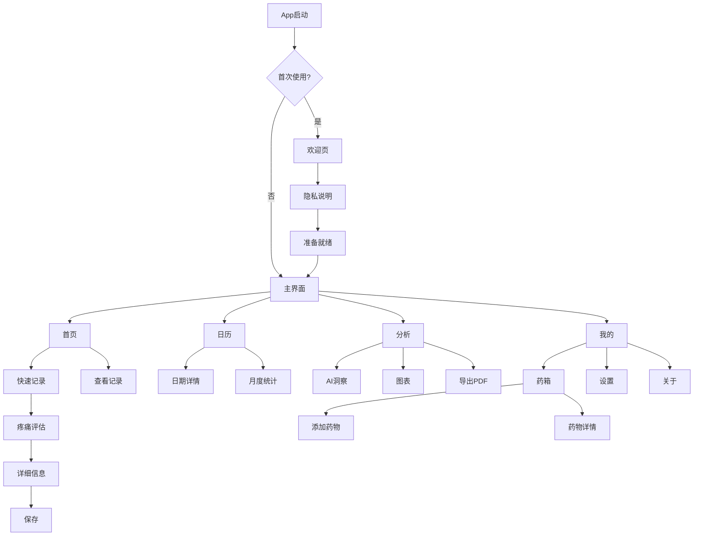
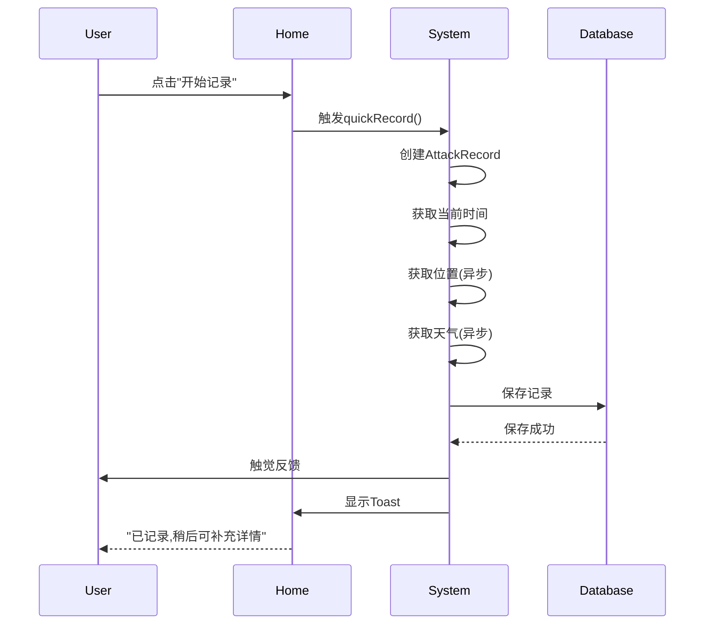
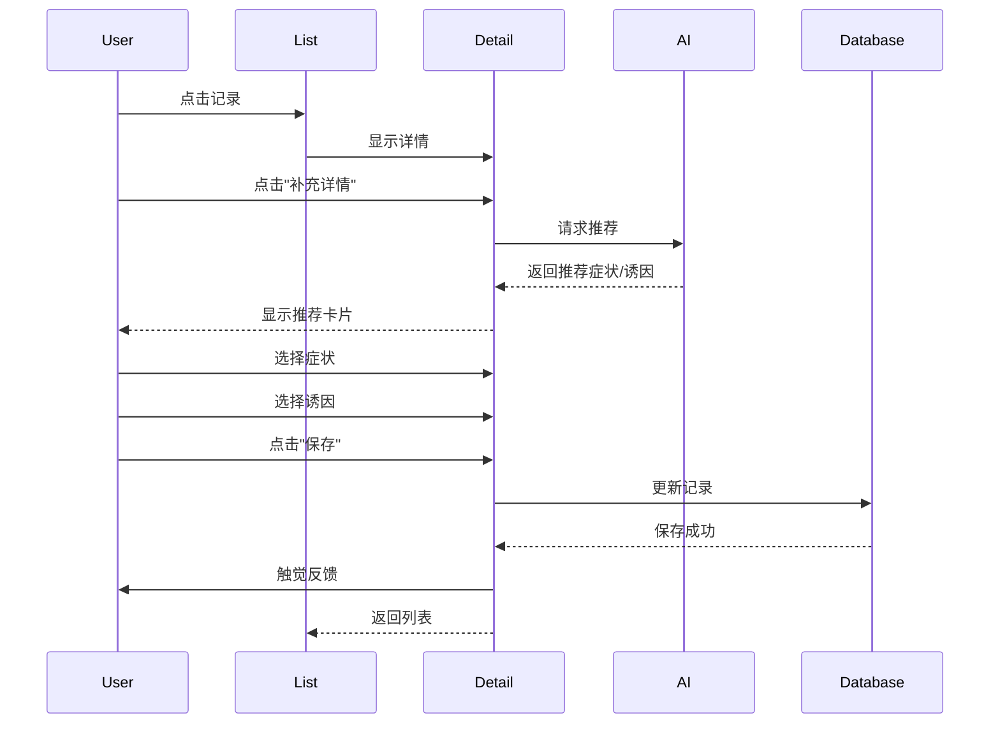
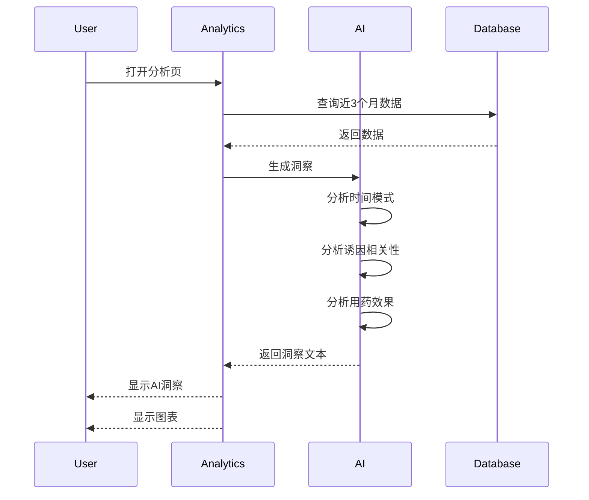

# 偏头痛记录App - 极简专业UI/UX设计方案

**版本**: 2.0  
**设计理念**: Medical Minimalism - 医疗极简主义  
**最后更新**: 2026年2月3日  
**设计平台**: iOS 17.0+  
**目标用户**: 18-55岁偏头痛患者

---

## 目录

1. [设计理念与战略](#1-设计理念与战略)
2. [设计系统](#2-设计系统)
3. [核心页面设计](#3-核心页面设计)
4. [交互设计规范](#4-交互设计规范)
5. [AI智能功能](#5-ai智能功能)
6. [可访问性标准](#6-可访问性标准)
7. [线框图与流程](#7-线框图与流程)
8. [实施指南](#8-实施指南)

---

## 1. 设计理念与战略

### 1.1 核心设计理念

**Medical Minimalism (医疗极简主义)**

在痛苦时刻提供最快速、最清晰的记录体验;在健康时刻提供最有价值的数据洞察。

#### 设计支柱

1. **速度至上** - 3秒完成核心记录
2. **数据洞察** - AI生成可操作的健康建议
3. **医疗专业** - 符合临床标准的数据收集
4. **隐私透明** - 可视化的数据流向和加密保护

### 1.2 与现有设计的根本差异

| 维度 | 现有设计 | 新设计 | 改变原因 |
|------|---------|--------|---------|
| **视觉风格** | 情感化、温暖、多装饰 | 极简、专业、纯净 | 减少视觉干扰,提升专业性 |
| **色彩系统** | 多色彩渐变(5色) | 单色系统(蓝+语义色) | 降低认知负担,符合医疗场景 |
| **记录流程** | 5步向导式 | 1步+可选详情 | 痛苦时快速记录是关键需求 |
| **首屏焦点** | 多个卡片平铺 | 单一超大记录按钮 | 明确主要操作,减少选择困难 |
| **动画效果** | 呼吸动效、弹簧动画 | 系统默认动画 | 减少装饰,避免刺激 |
| **卡片设计** | 圆角+阴影+背景色 | 简单分隔线 | 扁平化,减少视觉层级 |
| **数据展示** | 图表为主 | 文字洞察+简化图表 | AI生成结论比原始数据更有价值 |
| **信息密度** | 低(一屏1-2项) | 高(一屏3-4项) | 快速浏览关键信息 |

### 1.3 参考应用研究总结

#### Apple Health
- **学习点**: 极简的数据层级、交互式图表、安全徽章
- **应用**: 采用相同的白色背景+系统蓝、大字号数据展示

#### Cephalo
- **学习点**: "痛苦时简单,需要时全面"的理念、活跃发作卡片
- **应用**: 实现1秒快速记录+稍后补充详情的流程

#### Google Fit
- **学习点**: 聚焦核心指标、Material Design的留白使用
- **应用**: 首页只显示3个关键数字,其他收起

---

## 2. 设计系统

### 2.1 色彩系统

#### 主色调: iOS系统色

```swift
// 主色
static let primary = Color(hex: "007AFF")  // iOS系统蓝
static let primaryLight = Color(hex: "007AFF").opacity(0.1)

// 背景色
static let background = Color(uiColor: .systemBackground)  // 白色(浅)/黑色(深)
static let secondaryBackground = Color(uiColor: .secondarySystemBackground)  // #F2F2F7 / #1C1C1E
static let tertiaryBackground = Color(uiColor: .tertiarySystemBackground)  // #FFFFFF / #2C2C2E

// 文字色
static let label = Color(uiColor: .label)  // 黑色(浅)/白色(深)
static let secondaryLabel = Color(uiColor: .secondaryLabel)  // #3C3C43 99% / #EBEBF5 60%
static let tertiaryLabel = Color(uiColor: .tertiaryLabel)  // #3C3C43 48% / #EBEBF5 30%
```

#### 语义色: iOS系统色

```swift
// 状态色
static let success = Color(uiColor: .systemGreen)    // #34C759
static let warning = Color(uiColor: .systemOrange)   // #FF9500
static let danger = Color(uiColor: .systemRed)       // #FF3B30
static let info = Color(uiColor: .systemBlue)        // #007AFF

// 分隔线
static let separator = Color(uiColor: .separator)    // #3C3C43 36% / #545458 65%
```

#### 疼痛强度色阶: 单色渐变

**设计理由**: 避免红绿色盲问题,使用单一蓝色的透明度渐变

```swift
func painColor(for intensity: Int) -> Color {
    let opacity = 0.1 + (Double(intensity) / 10.0 * 0.9)
    return Color.primary.opacity(opacity)
}

// 0级: #007AFF 10%
// 5级: #007AFF 55%
// 10级: #007AFF 100%
```

#### 色彩使用规范

| 场景 | 颜色 | 说明 |
|------|------|------|
| 主按钮 | primary | 开始记录、保存等主要操作 |
| 次按钮 | secondaryLabel | 取消、返回等次要操作 |
| 数据数值 | label | 发作天数、疼痛强度等 |
| 说明文字 | secondaryLabel | 提示、单位等 |
| 成功反馈 | success | 记录保存成功 |
| MOH警告 | warning | 用药接近阈值 |
| MOH危险 | danger | 用药超过阈值 |
| 分隔线 | separator | 列表项之间 |

### 2.2 字体系统

#### 字体层级: SF Pro

```swift
// 数据展示
.largeTitle      // 34pt, Bold    - 关键数值 (如: 连续天数)
.title           // 28pt, Semibold - 页面标题
.title2          // 22pt, Semibold - 区块标题
.title3          // 20pt, Semibold - 卡片标题

// 内容层级
.body            // 17pt, Regular  - 正文内容
.callout         // 16pt, Regular  - 次要内容
.subheadline     // 15pt, Regular  - 列表项
.footnote        // 13pt, Regular  - 辅助说明
.caption         // 12pt, Regular  - 图表标签
.caption2        // 11pt, Regular  - 时间戳
```

#### 字重规范

**只使用3种字重**,避免视觉混乱:

- `Regular` - 正文、说明文字
- `Semibold` - 标题、强调文字  
- `Bold` - 关键数值、重要标题

#### 动态字体支持

```swift
// 所有文字必须支持动态字体
Text("疼痛强度")
    .font(.body)
    .dynamicTypeSize(.xSmall ... .accessibility3)  // 限制范围避免布局破坏
```

### 2.3 间距系统: 16pt Grid

**基础单位**: 16pt

```swift
enum Spacing {
    static let xxs: CGFloat = 4   // 图标与文字间距
    static let xs: CGFloat = 8    // 列表内元素间距
    static let sm: CGFloat = 12   // 组内元素间距
    static let md: CGFloat = 16   // 标准间距 (基础单位)
    static let lg: CGFloat = 24   // 组间间距
    static let xl: CGFloat = 32   // 区块间距
    static let xxl: CGFloat = 48  // 页面顶部间距
}

// 页面边距
static let pageHorizontal: CGFloat = 20  // iOS标准
static let pageTop: CGFloat = 16
static let pageBottom: CGFloat = 32
```

#### 间距使用场景

| 间距 | 使用场景 | 示例 |
|------|---------|------|
| 4pt | Icon-Text间距 | 图标和标签 |
| 8pt | 元素内间距 | 卡片内文字行间距 |
| 12pt | 紧密相关元素 | 标题和副标题 |
| 16pt | 标准间距 | 列表项之间 |
| 24pt | 组间间距 | 不同类别的内容块 |
| 32pt | 区块间距 | 大的分区之间 |
| 48pt | 页面留白 | 页面顶部到内容 |

### 2.4 圆角与边框

#### 圆角规范

```swift
enum CornerRadius {
    static let sm: CGFloat = 8    // 小元素 (Chip)
    static let md: CGFloat = 12   // 中等元素 (按钮)
    static let lg: CGFloat = 16   // 大元素 (卡片)
    static let xl: CGFloat = 24   // 主按钮
    static let full: CGFloat = .infinity  // 圆形
}
```

**新设计原则**: 少用圆角卡片,多用分隔线

```swift
// ❌ 旧设计: 卡片样式
VStack {
    // content
}
.padding()
.background(Color.secondaryBackground)
.cornerRadius(12)
.shadow(radius: 4)

// ✅ 新设计: 列表样式
VStack(alignment: .leading) {
    // content
}
.padding(.vertical, 12)
.overlay(Divider(), alignment: .bottom)
```

#### 边框规范

```swift
// 仅在需要强调边界时使用
.overlay(
    RoundedRectangle(cornerRadius: 12)
        .stroke(Color.separator, lineWidth: 0.5)
)
```

### 2.5 阴影规范

**新设计原则**: 去除所有装饰性阴影

```swift
// ❌ 禁止使用
.shadow(color: .black.opacity(0.1), radius: 8, x: 0, y: 2)

// ✅ 例外: 浮动按钮需要阴影表示可交互
.shadow(color: .black.opacity(0.15), radius: 12, x: 0, y: 4)
```

### 2.6 图标系统: SF Symbols Only

**100%使用系统图标**,不引入第三方图标库

#### 常用图标映射

| 功能 | SF Symbol | 尺寸 |
|------|-----------|------|
| 首页 | house.fill | 24pt |
| 记录 | plus.circle.fill | 24pt |
| 日历 | calendar | 24pt |
| 分析 | chart.bar.fill | 24pt |
| 药箱 | cross.case.fill | 24pt |
| 设置 | gearshape.fill | 24pt |
| 疼痛 | bolt.fill | 20pt |
| 症状 | waveform.path.ecg | 20pt |
| 诱因 | exclamationmark.triangle | 20pt |
| 用药 | pills.fill | 20pt |
| 天气 | cloud.sun.fill | 20pt |
| 成功 | checkmark.circle.fill | 20pt |
| 警告 | exclamationmark.circle.fill | 20pt |
| 危险 | xmark.octagon.fill | 20pt |
| 编辑 | pencil | 20pt |
| 删除 | trash | 20pt |
| 分享 | square.and.arrow.up | 20pt |
| 锁定 | lock.fill | 20pt |

#### 图标使用规范

```swift
// 导航栏图标
Image(systemName: "house.fill")
    .font(.system(size: 24, weight: .regular))
    .foregroundColor(.primary)

// 列表项图标
Image(systemName: "pills.fill")
    .font(.system(size: 20, weight: .semibold))
    .foregroundColor(.primary)
    .frame(width: 32, height: 32)

// 状态图标 (带语义色)
Image(systemName: "checkmark.circle.fill")
    .font(.system(size: 20))
    .foregroundColor(.success)
```

### 2.7 组件库

#### 2.7.1 按钮组件

**主按钮 (Primary Button)**

```swift
struct PrimaryButton: View {
    let title: String
    let action: () -> Void
    var isLoading: Bool = false
    
    var body: some View {
        Button(action: action) {
            HStack(spacing: 8) {
                if isLoading {
                    ProgressView()
                        .progressViewStyle(.circular)
                        .tint(.white)
                }
                Text(title)
                    .font(.body.weight(.semibold))
            }
            .frame(maxWidth: .infinity)
            .frame(height: 50)
            .foregroundColor(.white)
            .background(Color.primary)
            .cornerRadius(12)
        }
        .disabled(isLoading)
    }
}

// 使用示例
PrimaryButton(title: "开始记录", action: startRecording)
```

**次按钮 (Secondary Button)**

```swift
struct SecondaryButton: View {
    let title: String
    let action: () -> Void
    
    var body: some View {
        Button(action: action) {
            Text(title)
                .font(.body.weight(.semibold))
                .frame(maxWidth: .infinity)
                .frame(height: 50)
                .foregroundColor(.primary)
                .background(Color.clear)
                .overlay(
                    RoundedRectangle(cornerRadius: 12)
                        .stroke(Color.separator, lineWidth: 1)
                )
        }
    }
}
```

**文字按钮 (Text Button)**

```swift
struct TextButton: View {
    let title: String
    let action: () -> Void
    
    var body: some View {
        Button(action: action) {
            Text(title)
                .font(.body)
                .foregroundColor(.primary)
        }
    }
}
```

#### 2.7.2 列表组件

**简单列表行**

```swift
struct SimpleListRow: View {
    let title: String
    let value: String?
    let icon: String?
    let action: (() -> Void)?
    
    var body: some View {
        Button(action: action ?? {}) {
            HStack(spacing: 12) {
                if let icon = icon {
                    Image(systemName: icon)
                        .font(.system(size: 20))
                        .foregroundColor(.primary)
                        .frame(width: 28, height: 28)
                }
                
                Text(title)
                    .font(.body)
                    .foregroundColor(.label)
                
                Spacer()
                
                if let value = value {
                    Text(value)
                        .font(.body)
                        .foregroundColor(.secondaryLabel)
                }
                
                if action != nil {
                    Image(systemName: "chevron.right")
                        .font(.system(size: 14, weight: .semibold))
                        .foregroundColor(.tertiaryLabel)
                }
            }
            .padding(.vertical, 12)
            .contentShape(Rectangle())
        }
        .buttonStyle(.plain)
        .overlay(Divider(), alignment: .bottom)
    }
}
```

#### 2.7.3 数据展示组件

**大数值卡片**

```swift
struct LargeNumberCard: View {
    let value: String
    let label: String
    let unit: String?
    
    var body: some View {
        VStack(spacing: 4) {
            HStack(alignment: .firstTextBaseline, spacing: 4) {
                Text(value)
                    .font(.system(size: 48, weight: .bold))
                    .foregroundColor(.label)
                
                if let unit = unit {
                    Text(unit)
                        .font(.title3)
                        .foregroundColor(.secondaryLabel)
                }
            }
            
            Text(label)
                .font(.subheadline)
                .foregroundColor(.secondaryLabel)
        }
    }
}

// 使用示例
LargeNumberCard(value: "12", label: "连续无头痛天数", unit: "天")
```

**三列数据行**

```swift
struct ThreeColumnStat: View {
    let stat1: (value: String, label: String)
    let stat2: (value: String, label: String)
    let stat3: (value: String, label: String)
    
    var body: some View {
        HStack(spacing: 0) {
            StatColumn(value: stat1.value, label: stat1.label)
            Divider()
            StatColumn(value: stat2.value, label: stat2.label)
            Divider()
            StatColumn(value: stat3.value, label: stat3.label)
        }
        .frame(height: 70)
    }
    
    struct StatColumn: View {
        let value: String
        let label: String
        
        var body: some View {
            VStack(spacing: 4) {
                Text(value)
                    .font(.title2.weight(.bold))
                    .foregroundColor(.label)
                Text(label)
                    .font(.caption)
                    .foregroundColor(.secondaryLabel)
            }
            .frame(maxWidth: .infinity)
        }
    }
}
```

#### 2.7.4 输入组件

**选择芯片 (Chip)**

```swift
struct SelectableChip: View {
    let label: String
    @Binding var isSelected: Bool
    
    var body: some View {
        Button {
            isSelected.toggle()
            UIImpactFeedbackGenerator(style: .light).impactOccurred()
        } label: {
            HStack(spacing: 4) {
                if isSelected {
                    Image(systemName: "checkmark")
                        .font(.system(size: 12, weight: .bold))
                }
                Text(label)
                    .font(.subheadline)
            }
            .padding(.horizontal, 12)
            .padding(.vertical, 8)
            .background(isSelected ? Color.primary : Color.secondaryBackground)
            .foregroundColor(isSelected ? .white : .label)
            .cornerRadius(8)
        }
        .buttonStyle(.plain)
    }
}
```

---

## 3. 核心页面设计

### 3.1 首页 (Home Dashboard)

#### 设计目标

1. 一眼看到当前状态 (无头痛 vs 发作中)
2. 一键开始记录 (最大、最明显的按钮)
3. 快速浏览关键数据 (本月统计)

#### 布局结构

```
┌─────────────────────────────────────┐
│  Navigation Bar                     │
│  头痛记录            [Settings]     │
├─────────────────────────────────────┤
│                                     │
│  ┌───────────────────────────────┐ │
│  │  [当前状态区]                 │ │
│  │                               │ │
│  │        12                     │ │
│  │    连续无头痛天数             │ │
│  │                               │ │
│  └───────────────────────────────┘ │
│                                     │
│  ┌───────────────────────────────┐ │
│  │  [主操作按钮 - 超大]          │ │
│  │                               │ │
│  │          +                    │ │
│  │      开始记录                 │ │
│  │                               │ │
│  │  轻点记录,稍后可补充详情      │ │
│  └───────────────────────────────┘ │
│                                     │
│  ─────────────────────────────────  │
│  本月概览                           │
│  ─────────────────────────────────  │
│                                     │
│  8天     6.5/10     7次            │
│  发作天数  平均强度  用药次数       │
│                                     │
│  ─────────────────────────────────  │
│  最近记录                           │
│  ─────────────────────────────────  │
│                                     │
│  2月2日 14:30    强度 7       →    │
│  持续2小时        已用药            │
│  ─────────────────────────────────  │
│                                     │
└─────────────────────────────────────┘
```

#### 核心组件规范

**1. 当前状态区**

```swift
struct CurrentStatusView: View {
    let streakDays: Int
    let isOngoing: Bool
    let ongoingDuration: TimeInterval?
    
    var body: some View {
        VStack(spacing: 8) {
            if isOngoing {
                // 发作进行中
                Text("发作进行中")
                    .font(.title3.weight(.semibold))
                    .foregroundColor(.danger)
                
                if let duration = ongoingDuration {
                    Text("已持续 \(formatDuration(duration))")
                        .font(.subheadline)
                        .foregroundColor(.secondaryLabel)
                }
            } else {
                // 无发作
                Text("\(streakDays)")
                    .font(.system(size: 72, weight: .bold))
                    .foregroundColor(.primary)
                
                Text("连续无头痛天数")
                    .font(.title3)
                    .foregroundColor(.secondaryLabel)
            }
        }
        .frame(maxWidth: .infinity)
        .padding(.vertical, 32)
        .background(Color.secondaryBackground)
        .cornerRadius(16)
    }
}
```

**2. 快速记录按钮**

```swift
struct QuickRecordButton: View {
    let action: () -> Void
    
    var body: some View {
        Button(action: {
            UIImpactFeedbackGenerator(style: .medium).impactOccurred()
            action()
        }) {
            VStack(spacing: 16) {
                Image(systemName: "plus.circle.fill")
                    .font(.system(size: 64))
                    .foregroundColor(.primary)
                
                Text("开始记录")
                    .font(.title2.weight(.semibold))
                    .foregroundColor(.label)
                
                Text("轻点记录,稍后可补充详情")
                    .font(.caption)
                    .foregroundColor(.secondaryLabel)
            }
            .frame(maxWidth: .infinity)
            .padding(.vertical, 40)
            .background(Color.secondaryBackground)
            .cornerRadius(16)
        }
        .buttonStyle(.plain)
    }
}
```

**3. 本月概览**

```swift
struct MonthlyOverview: View {
    let attackDays: Int
    let averageIntensity: Double
    let medicationCount: Int
    
    var body: some View {
        VStack(spacing: 16) {
            HStack {
                Text("本月概览")
                    .font(.title3.weight(.semibold))
                Spacer()
            }
            
            ThreeColumnStat(
                stat1: ("\(attackDays)天", "发作天数"),
                stat2: (String(format: "%.1f/10", averageIntensity), "平均强度"),
                stat3: ("\(medicationCount)次", "用药次数")
            )
        }
    }
}
```

#### 页面交互

- **下拉刷新**: 刷新统计数据
- **点击状态区**: 查看详细统计
- **点击记录按钮**: 立即创建新记录
- **点击最近记录**: 查看记录详情

### 3.2 快速记录流程

#### 设计哲学

**"痛苦时简单,需要时全面"**

- **Step 0**: 一键记录 (必需,1秒完成)
- **Step 1**: 疼痛评估 (可选,稍后补充)
- **Step 2**: 详细信息 (可选,稍后补充)

#### Step 0: 一键记录

**触发**: 点击首页"开始记录"按钮

**自动捕获**:
- 当前时间 (startTime)
- 当前位置 (如已授权)
- 当前天气 (如WeatherKit可用)
- 状态: 进行中 (endTime = nil)

**用户反馈**:
```swift
// Toast提示
"已记录 14:32 的头痛发作,稍后可补充详情"
```

**完整流程代码示例**:

```swift
func quickRecord() {
    // 创建基础记录
    let attack = AttackRecord(
        startTime: Date(),
        status: .ongoing
    )
    
    // 异步获取位置和天气
    Task {
        if let location = await locationManager.getCurrentLocation() {
            attack.location = location
        }
        if let weather = await weatherManager.getCurrentWeather() {
            attack.weatherSnapshot = weather
        }
    }
    
    // 保存
    modelContext.insert(attack)
    try? modelContext.save()
    
    // 触觉反馈
    UINotificationFeedbackGenerator().notificationOccurred(.success)
    
    // 显示Toast
    showToast("已记录,稍后可补充详情")
}
```

#### Step 1: 疼痛评估 (可选)

**入口**: 从记录列表点击"补充详情"

```
┌─────────────────────────────────────┐
│  < 返回        疼痛评估      保存   │
├─────────────────────────────────────┤
│                                     │
│  疼痛强度                           │
│                                     │
│  ━━━━━━●━━━━━━━━━━━━              │
│  0                           10     │
│  无痛                        剧痛   │
│                                     │
│         5                           │
│    (中度疼痛)                       │
│                                     │
│  ─────────────────────────────────  │
│                                     │
│  疼痛部位                           │
│  [头部简图 - 可点选多个区域]        │
│                                     │
│  已选择: 左侧太阳穴、前额           │
│                                     │
│  ─────────────────────────────────  │
│                                     │
│  疼痛性质                           │
│  [搏动性] [压迫感] [刺痛]         │
│  [钝痛] [胀痛]                     │
│                                     │
└─────────────────────────────────────┘
```

**核心组件: 简约滑块**

```swift
struct PainIntensitySlider: View {
    @Binding var value: Int
    
    var body: some View {
        VStack(spacing: 24) {
            // 当前值显示
            Text("\(value)")
                .font(.system(size: 72, weight: .bold))
                .foregroundColor(painColor(for: value))
            
            Text(painLabel(for: value))
                .font(.subheadline)
                .foregroundColor(.secondaryLabel)
            
            // 滑块
            Slider(
                value: Binding(
                    get: { Double(value) },
                    set: { value = Int($0) }
                ),
                in: 0...10,
                step: 1
            )
            .tint(.primary)
            
            // 标签
            HStack {
                Text("0\n无痛")
                    .font(.caption)
                    .foregroundColor(.secondaryLabel)
                    .multilineTextAlignment(.leading)
                Spacer()
                Text("10\n剧痛")
                    .font(.caption)
                    .foregroundColor(.secondaryLabel)
                    .multilineTextAlignment(.trailing)
            }
        }
        .padding()
    }
    
    func painLabel(for value: Int) -> String {
        switch value {
        case 0: return "无疼痛"
        case 1...3: return "轻微不适"
        case 4...6: return "中度疼痛"
        case 7...9: return "严重疼痛"
        case 10: return "极度痛苦"
        default: return ""
        }
    }
    
    func painColor(for value: Int) -> Color {
        return Color.primary.opacity(0.1 + Double(value) / 10.0 * 0.9)
    }
}
```

#### Step 2: 详细信息 (可选)

**布局**: 可折叠分组列表

```
┌─────────────────────────────────────┐
│  < 返回        详细信息      保存   │
├─────────────────────────────────────┤
│                                     │
│  > 症状 (AI推荐)              [3]  │
│    恶心、畏光、呕吐                 │
│                                     │
│  ─────────────────────────────────  │
│                                     │
│  > 诱因 (基于历史)            [2]  │
│    压力、睡眠不足                   │
│                                     │
│  ─────────────────────────────────  │
│                                     │
│  > 用药                             │
│    布洛芬 400mg, 14:45             │
│    + 添加用药                       │
│                                     │
│  ─────────────────────────────────  │
│                                     │
│  > 备注                             │
│    [文本框: 今天工作压力很大...]    │
│                                     │
└─────────────────────────────────────┘
```

**可折叠组实现**:

```swift
struct CollapsibleSection<Content: View>: View {
    let title: String
    let count: Int?
    @State private var isExpanded: Bool = false
    @ViewBuilder let content: () -> Content
    
    var body: some View {
        VStack(spacing: 0) {
            Button {
                withAnimation(.easeInOut(duration: 0.2)) {
                    isExpanded.toggle()
                }
            } label: {
                HStack {
                    Text(title)
                        .font(.body.weight(.semibold))
                        .foregroundColor(.label)
                    
                    if let count = count, count > 0 {
                        Text("(\(count))")
                            .font(.subheadline)
                            .foregroundColor(.secondaryLabel)
                    }
                    
                    Spacer()
                    
                    Image(systemName: isExpanded ? "chevron.up" : "chevron.down")
                        .font(.system(size: 14, weight: .semibold))
                        .foregroundColor(.secondaryLabel)
                }
                .padding(.vertical, 12)
                .contentShape(Rectangle())
            }
            .buttonStyle(.plain)
            
            if isExpanded {
                content()
                    .transition(.opacity.combined(with: .move(edge: .top)))
            }
        }
        .overlay(Divider(), alignment: .bottom)
    }
}
```

### 3.3 数据分析页

#### 设计目标

1. AI生成文字洞察 (可读性 > 图表)
2. 简化的数据可视化
3. 可操作的健康建议

#### 布局结构

```
┌─────────────────────────────────────┐
│  分析                    [导出PDF]  │
│  过去3个月                          │
├─────────────────────────────────────┤
│                                     │
│  ┌─────────────────────────────────┐│
│  │ 💡 关键发现                     ││
│  │                                 ││
│  │ • 您通常在早晨6-9点发作 (60%)  ││
│  │ • 工作日发作频率高于周末        ││
│  │ • 压力是最常见诱因 (67%)        ││
│  │                                 ││
│  └─────────────────────────────────┘│
│                                     │
│  ─────────────────────────────────  │
│  月度趋势                           │
│  ─────────────────────────────────  │
│                                     │
│  [简化柱状图]                       │
│   8天  10天  12天  9天  7天  8天   │
│   11月 12月  1月  2月  3月  4月    │
│                                     │
│  ─────────────────────────────────  │
│  诱因分析                           │
│  ─────────────────────────────────  │
│                                     │
│  1. 压力           67%  ■■■■■■■  │
│  2. 睡眠不足       45%  ■■■■■      │
│  3. 天气变化       34%  ■■■         │
│  4. 味精食物       28%  ■■          │
│  5. 饮酒           15%  ■           │
│                                     │
│  ─────────────────────────────────  │
│  用药分析                           │
│  ─────────────────────────────────  │
│                                     │
│  布洛芬                             │
│  本月使用 8/15天   ████████░░░░░░░ │
│  平均缓解时间: 1.5小时              │
│                                     │
│  ⚠️ 接近MOH阈值,建议咨询医生       │
│                                     │
└─────────────────────────────────────┘
```

#### 核心组件

**1. AI洞察卡片**

```swift
struct InsightCard: View {
    let insights: [String]
    
    var body: some View {
        VStack(alignment: .leading, spacing: 12) {
            HStack {
                Image(systemName: "lightbulb.fill")
                    .foregroundColor(.warning)
                Text("关键发现")
                    .font(.title3.weight(.semibold))
            }
            
            ForEach(insights, id: \.self) { insight in
                HStack(alignment: .top, spacing: 8) {
                    Text("•")
                        .foregroundColor(.secondaryLabel)
                    Text(insight)
                        .font(.body)
                        .foregroundColor(.label)
                }
            }
        }
        .padding()
        .background(Color.warning.opacity(0.1))
        .cornerRadius(12)
    }
}
```

**2. 简化柱状图**

```swift
import Charts

struct SimplifiedBarChart: View {
    let data: [MonthData]
    
    var body: some View {
        VStack(alignment: .leading, spacing: 16) {
            Text("月度趋势")
                .font(.title3.weight(.semibold))
            
            Chart(data) { item in
                BarMark(
                    x: .value("月份", item.month, unit: .month),
                    y: .value("天数", item.days)
                )
                .foregroundStyle(Color.primary)
                .cornerRadius(4)
            }
            .frame(height: 200)
            .chartXAxis {
                AxisMarks(values: .stride(by: .month)) { _ in
                    AxisValueLabel(format: .dateTime.month(.abbreviated))
                }
            }
            .chartYAxis {
                AxisMarks(position: .leading)
            }
        }
    }
}
```

**3. 诱因频次列表**

```swift
struct TriggerFrequencyList: View {
    let triggers: [(name: String, percentage: Int)]
    
    var body: some View {
        VStack(alignment: .leading, spacing: 16) {
            Text("诱因分析")
                .font(.title3.weight(.semibold))
            
            ForEach(Array(triggers.enumerated()), id: \.offset) { index, trigger in
                HStack {
                    Text("\(index + 1). \(trigger.name)")
                        .font(.body)
                        .foregroundColor(.label)
                    
                    Spacer()
                    
                    Text("\(trigger.percentage)%")
                        .font(.body.weight(.semibold))
                        .foregroundColor(.primary)
                    
                    // 进度条
                    GeometryReader { geometry in
                        HStack(spacing: 2) {
                            ForEach(0..<10) { i in
                                Rectangle()
                                    .fill(i < trigger.percentage / 10 ? Color.primary : Color.separator)
                                    .frame(width: 8, height: 16)
                            }
                        }
                    }
                    .frame(width: 100)
                }
                .padding(.vertical, 4)
            }
        }
    }
}
```

### 3.4 药箱页面

#### 设计目标

1. 清单式布局,一目了然
2. MOH警告内联显示
3. 快速访问用药历史

#### 布局结构

```
┌─────────────────────────────────────┐
│  药箱                          [+]  │
├─────────────────────────────────────┤
│                                     │
│  急性用药                           │
│  ─────────────────────────────────  │
│                                     │
│  布洛芬 400mg                       │
│  本月 8/15天                  →     │
│  ─────────────────────────────────  │
│                                     │
│  佐米曲普坦 5mg                     │
│  本月 3/10天                  →     │
│  ─────────────────────────────────  │
│                                     │
│  曲安缩松 10mg                      │
│  本月 12/15天  ⚠️ 接近阈值    →     │
│  ─────────────────────────────────  │
│                                     │
│  预防性用药                         │
│  ─────────────────────────────────  │
│                                     │
│  氟桂利嗪 5mg                       │
│  依从性 85%                   →     │
│  每日 20:00                         │
│  ─────────────────────────────────  │
│                                     │
└─────────────────────────────────────┘
```

#### 核心组件

**药物列表行**

```swift
struct MedicationRow: View {
    let medication: Medication
    let usageThisMonth: Int
    let mohWarning: Bool
    
    var body: some View {
        Button {
            // 导航到药物详情
        } label: {
            VStack(alignment: .leading, spacing: 8) {
                HStack {
                    Text(medication.name)
                        .font(.body.weight(.semibold))
                        .foregroundColor(.label)
                    
                    Spacer()
                    
                    Image(systemName: "chevron.right")
                        .font(.system(size: 14))
                        .foregroundColor(.tertiaryLabel)
                }
                
                HStack(spacing: 16) {
                    if medication.isAcute {
                        Text("本月 \(usageThisMonth)/\(medication.monthlyLimit ?? 15)天")
                            .font(.subheadline)
                            .foregroundColor(.secondaryLabel)
                    } else {
                        Text("依从性 \(medication.adherence)%")
                            .font(.subheadline)
                            .foregroundColor(.secondaryLabel)
                        
                        if let time = medication.dailyReminderTime {
                            Text("每日 \(formatTime(time))")
                                .font(.subheadline)
                                .foregroundColor(.secondaryLabel)
                        }
                    }
                    
                    if mohWarning {
                        HStack(spacing: 4) {
                            Image(systemName: "exclamationmark.triangle.fill")
                            Text("接近阈值")
                        }
                        .font(.caption)
                        .foregroundColor(.warning)
                    }
                }
            }
            .padding(.vertical, 12)
            .contentShape(Rectangle())
        }
        .buttonStyle(.plain)
        .overlay(Divider(), alignment: .bottom)
    }
}
```

### 3.5 日历页面

#### 设计目标

1. 热力图快速识别模式
2. 本月统计一目了然
3. 点击日期查看详情

#### 布局结构

```
┌─────────────────────────────────────┐
│  日历                               │
│                                     │
│  < 2026年2月 >                      │
├─────────────────────────────────────┤
│                                     │
│  日  一  二  三  四  五  六         │
│                                     │
│  28  29  30  31  1   2   3          │
│                  ○   ●   ○          │
│                                     │
│  4   5   6   7   8   9   10         │
│  ●   ○       ●   ○       ●          │
│                                     │
│  11  12  13  14  15  16  17         │
│           ◐       ○                 │
│                                     │
│  18  19  20  21  22  23  24         │
│  ●                   ○              │
│                                     │
│  25  26  27  28  29  1   2          │
│                                     │
│  ─────────────────────────────────  │
│                                     │
│  本月统计                           │
│  8天     6.5/10     7次             │
│  发作天数  平均强度  用药次数       │
│                                     │
│  ─────────────────────────────────  │
│                                     │
│  图例:                              │
│  ○ 轻度 (1-3)  ◐ 中度 (4-6)       │
│  ● 重度 (7-10)                     │
│                                     │
└─────────────────────────────────────┘
```

#### 核心组件

**日历单元格**

```swift
struct CalendarDayCell: View {
    let date: Date?
    let attack: AttackRecord?
    let isToday: Bool
    
    var body: some View {
        VStack(spacing: 4) {
            if let date = date {
                Text("\(Calendar.current.component(.day, from: date))")
                    .font(.subheadline)
                    .foregroundColor(isToday ? .white : .label)
                
                if let attack = attack {
                    intensityIndicator(for: attack.painIntensity)
                } else {
                    Spacer()
                        .frame(height: 8)
                }
            }
        }
        .frame(maxWidth: .infinity)
        .frame(height: 44)
        .background(isToday ? Color.primary : Color.clear)
        .cornerRadius(8)
    }
    
    @ViewBuilder
    func intensityIndicator(for intensity: Int) -> some View {
        Circle()
            .fill(intensityColor(for: intensity))
            .frame(width: 8, height: 8)
    }
    
    func intensityColor(for intensity: Int) -> Color {
        switch intensity {
        case 0...3: return Color.primary.opacity(0.3)  // ○
        case 4...6: return Color.primary.opacity(0.6)  // ◐
        case 7...10: return Color.primary              // ●
        default: return .clear
        }
    }
}
```

---

## 4. 交互设计规范

### 4.1 手势操作表

| 手势 | 位置 | 功能 | 反馈 |
|------|------|------|------|
| **点击 (Tap)** | 主按钮 | 执行主要操作 | 轻微触觉 + 视觉高亮 |
| **点击** | 列表项 | 查看详情 | 导航动画 |
| **长按 (Long Press)** | 日历日期 | 快速添加记录 | 中等触觉 + 菜单弹出 |
| **左滑 (Swipe Left)** | 列表项 | 显示编辑/删除 | 轻微触觉 |
| **右滑 (Swipe Right)** | 列表项 | 快速完成 | 成功触觉 + 绿色动画 |
| **下拉 (Pull to Refresh)** | 页面顶部 | 刷新数据 | 系统刷新指示器 |
| **双击 (Double Tap)** | 记录卡片 | 快速编辑 | 中等触觉 + 编辑界面 |

### 4.2 动画规范

#### 允许的动画

**1. 系统默认动画**

```swift
// 导航转场 (系统默认)
NavigationLink(destination: DetailView()) {
    Text("查看详情")
}

// 模态弹出 (系统默认)
.sheet(isPresented: $showSheet) {
    RecordingView()
}
```

**2. 数据加载动画**

```swift
// 系统Spinner
ProgressView()
    .progressViewStyle(.circular)
```

**3. 按钮反馈动画**

```swift
struct SimpleButtonStyle: ButtonStyle {
    func makeBody(configuration: Configuration) -> some View {
        configuration.label
            .opacity(configuration.isPressed ? 0.6 : 1.0)
            .animation(.easeInOut(duration: 0.1), value: configuration.isPressed)
    }
}
```

#### 禁止的动画

- ❌ 呼吸动效 (breathing animation)
- ❌ 渐变动画 (gradient animation)
- ❌ 粒子效果 (particle effects)
- ❌ 弹簧动画 (spring animation with bounce)
- ❌ 持续循环动画 (infinite loop)

### 4.3 触觉反馈规范

**使用原则**: 精准、有意义、不过度

```swift
enum HapticFeedback {
    case light      // 轻微反馈 - 选择选项
    case medium     // 中等反馈 - 按钮点击
    case heavy      // 重度反馈 - (不使用)
    case success    // 成功 - 保存成功
    case warning    // 警告 - MOH警告
    case error      // 错误 - 操作失败
    
    func trigger() {
        switch self {
        case .light:
            UIImpactFeedbackGenerator(style: .light).impactOccurred()
        case .medium:
            UIImpactFeedbackGenerator(style: .medium).impactOccurred()
        case .success:
            UINotificationFeedbackGenerator().notificationOccurred(.success)
        case .warning:
            UINotificationFeedbackGenerator().notificationOccurred(.warning)
        case .error:
            UINotificationFeedbackGenerator().notificationOccurred(.error)
        default:
            break
        }
    }
}
```

**使用场景**:

| 场景 | 反馈类型 |
|------|---------|
| 选择Chip | light |
| 点击记录按钮 | medium |
| 记录保存成功 | success |
| MOH警告触发 | warning |
| 保存失败 | error |
| 滑块拖动 | light (每个整数值) |

### 4.4 页面转场

**标准转场**: 使用系统默认

```swift
// Push导航
NavigationLink(destination: DetailView()) {
    Text("详情")
}

// 模态弹出
.sheet(isPresented: $showSheet) {
    SheetView()
}

// 全屏覆盖
.fullScreenCover(isPresented: $showFullScreen) {
    FullScreenView()
}
```

**转场时机选择**:

| 场景 | 转场类型 | 理由 |
|------|---------|------|
| 查看详情 | Push导航 | 有返回路径 |
| 记录流程 | Sheet | 独立任务,可取消 |
| 设置页面 | Push导航 | 层级关系 |
| 重要提示 | Sheet | 需要用户确认 |

---

## 5. AI智能功能

### 5.1 智能推荐引擎

#### 设计目标

基于用户历史数据,智能预测和推荐症状、诱因,减少80%的点击次数。

#### 推荐算法逻辑

**1. 基于频率的推荐**

```swift
class SmartRecommendationEngine {
    // 推荐最常见的3个症状
    func recommendSymptoms(for user: User) -> [Symptom] {
        let recentAttacks = user.attacks.suffix(10)
        let symptomFrequency = Dictionary(grouping: recentAttacks.flatMap { $0.symptoms }) { $0.type }
            .mapValues { $0.count }
            .sorted { $0.value > $1.value }
        
        return Array(symptomFrequency.prefix(3).map { $0.key })
    }
    
    // 推荐最可能的诱因
    func recommendTriggers(for user: User) -> [Trigger] {
        let recentAttacks = user.attacks.suffix(10)
        let triggerFrequency = Dictionary(grouping: recentAttacks.flatMap { $0.triggers }) { $0.type }
            .mapValues { $0.count }
            .sorted { $0.value > $1.value }
        
        return Array(triggerFrequency.prefix(3).map { $0.key })
    }
}
```

**2. 基于时间模式的推荐**

```swift
extension SmartRecommendationEngine {
    // 根据时间推荐诱因
    func contextualTriggers(at time: Date) -> [Trigger] {
        let hour = Calendar.current.component(.hour, from: time)
        let dayOfWeek = Calendar.current.component(.weekday, from: time)
        
        var recommendations: [Trigger] = []
        
        // 周一早晨 → 推荐"工作压力"、"周末睡眠改变"
        if dayOfWeek == 2 && hour >= 6 && hour <= 10 {
            recommendations.append(contentsOf: [.stress, .sleepChange])
        }
        
        // 晚上 → 推荐"眼睛疲劳"、"屏幕时间"
        if hour >= 18 && hour <= 22 {
            recommendations.append(contentsOf: [.eyeStrain, .screenTime])
        }
        
        return recommendations
    }
}
```

**3. 基于气象数据的推荐**

```swift
extension SmartRecommendationEngine {
    // 根据天气推荐诱因
    func weatherBasedTriggers(weather: WeatherSnapshot) -> [Trigger] {
        var recommendations: [Trigger] = []
        
        // 气压骤降
        if weather.pressureTrend == .falling && weather.pressureChange > 5 {
            recommendations.append(.pressureChange)
        }
        
        // 高湿度
        if weather.humidity > 80 {
            recommendations.append(.humidity)
        }
        
        // 极端温度
        if weather.temperature > 35 || weather.temperature < 0 {
            recommendations.append(.temperature)
        }
        
        return recommendations
    }
}
```

#### UI集成

**推荐卡片组件**

```swift
struct AIRecommendationCard: View {
    let title: String
    let recommendations: [String]
    let onSelect: (String) -> Void
    
    var body: some View {
        VStack(alignment: .leading, spacing: 12) {
            HStack {
                Image(systemName: "sparkles")
                    .foregroundColor(.primary)
                Text(title)
                    .font(.subheadline.weight(.semibold))
                    .foregroundColor(.label)
            }
            
            FlowLayout(spacing: 8) {
                ForEach(recommendations, id: \.self) { item in
                    Button {
                        onSelect(item)
                        HapticFeedback.light.trigger()
                    } label: {
                        HStack(spacing: 4) {
                            Image(systemName: "plus.circle.fill")
                                .font(.system(size: 12))
                            Text(item)
                                .font(.subheadline)
                        }
                        .padding(.horizontal, 12)
                        .padding(.vertical, 6)
                        .background(Color.primary.opacity(0.1))
                        .foregroundColor(.primary)
                        .cornerRadius(8)
                    }
                }
            }
        }
        .padding()
        .background(Color.secondaryBackground)
        .cornerRadius(12)
    }
}

// 使用示例
AIRecommendationCard(
    title: "常见症状",
    recommendations: ["恶心", "畏光", "呕吐"],
    onSelect: { symptom in
        // 自动添加到已选列表
    }
)
```

### 5.2 数据洞察生成

#### AI分析引擎

```swift
class DataInsightGenerator {
    // 生成关键发现
    func generateInsights(from attacks: [AttackRecord]) -> [String] {
        var insights: [String] = []
        
        // 1. 时间模式分析
        if let timePattern = analyzeTimePattern(attacks) {
            insights.append(timePattern)
        }
        
        // 2. 诱因相关性分析
        if let triggerInsight = analyzeTriggers(attacks) {
            insights.append(triggerInsight)
        }
        
        // 3. 用药效果分析
        if let medicationInsight = analyzeMedication(attacks) {
            insights.append(medicationInsight)
        }
        
        // 4. 周期性分析
        if let cyclicPattern = analyzeCyclicPattern(attacks) {
            insights.append(cyclicPattern)
        }
        
        return insights
    }
    
    private func analyzeTimePattern(_ attacks: [AttackRecord]) -> String? {
        let hourCounts = Dictionary(grouping: attacks) { attack in
            Calendar.current.component(.hour, from: attack.startTime)
        }.mapValues { $0.count }
        
        guard let peakHour = hourCounts.max(by: { $0.value < $1.value }) else {
            return nil
        }
        
        let percentage = Int(Double(peakHour.value) / Double(attacks.count) * 100)
        
        if peakHour.key >= 6 && peakHour.key <= 9 {
            return "您通常在早晨6-9点发作 (\(percentage)%)"
        } else if peakHour.key >= 14 && peakHour.key <= 17 {
            return "您通常在下午2-5点发作 (\(percentage)%)"
        }
        
        return nil
    }
    
    private func analyzeTriggers(_ attacks: [AttackRecord]) -> String? {
        let triggerCounts = Dictionary(grouping: attacks.flatMap { $0.triggers }) { $0.type }
            .mapValues { $0.count }
            .sorted { $0.value > $1.value }
        
        guard let topTrigger = triggerCounts.first else {
            return nil
        }
        
        let percentage = Int(Double(topTrigger.value) / Double(attacks.count) * 100)
        return "\(topTrigger.key.displayName)是最常见诱因 (\(percentage)%)"
    }
    
    private func analyzeMedication(_ attacks: [AttackRecord]) -> String? {
        let medicatedAttacks = attacks.filter { !$0.medicationLogs.isEmpty }
        
        guard !medicatedAttacks.isEmpty else {
            return nil
        }
        
        // 计算平均缓解时间
        let avgReliefTime = medicatedAttacks.compactMap { attack -> TimeInterval? in
            guard let medLog = attack.medicationLogs.first,
                  let endTime = attack.endTime else {
                return nil
            }
            return endTime.timeIntervalSince(medLog.takenAt)
        }.reduce(0, +) / Double(medicatedAttacks.count)
        
        let hours = Int(avgReliefTime / 3600)
        let minutes = Int((avgReliefTime.truncatingRemainder(dividingBy: 3600)) / 60)
        
        return "平均缓解时间: \(hours)小时\(minutes)分钟"
    }
    
    private func analyzeCyclicPattern(_ attacks: [AttackRecord]) -> String? {
        let weekdayCounts = Dictionary(grouping: attacks) { attack in
            Calendar.current.component(.weekday, from: attack.startTime)
        }.mapValues { $0.count }
        
        let weekdayTotal = (weekdayCounts[2] ?? 0) + (weekdayCounts[3] ?? 0) + (weekdayCounts[4] ?? 0) + (weekdayCounts[5] ?? 0) + (weekdayCounts[6] ?? 0)
        let weekendTotal = (weekdayCounts[1] ?? 0) + (weekdayCounts[7] ?? 0)
        
        if weekdayTotal > weekendTotal * 1.5 {
            return "工作日发作频率明显高于周末"
        } else if weekendTotal > weekdayTotal * 1.5 {
            return "周末发作频率明显高于工作日"
        }
        
        return nil
    }
}
```

### 5.3 语音输入 (未来功能)

#### 设计概念

```swift
struct VoiceInputView: View {
    @State private var isRecording = false
    @State private var transcript = ""
    
    var body: some View {
        VStack(spacing: 24) {
            // 麦克风按钮
            Button {
                toggleRecording()
            } label: {
                Image(systemName: isRecording ? "mic.fill" : "mic")
                    .font(.system(size: 48))
                    .foregroundColor(isRecording ? .danger : .primary)
                    .frame(width: 100, height: 100)
                    .background(Color.secondaryBackground)
                    .clipShape(Circle())
            }
            
            // 识别文本
            if !transcript.isEmpty {
                Text(transcript)
                    .font(.body)
                    .foregroundColor(.label)
                    .multilineTextAlignment(.center)
                    .padding()
            }
            
            // 提示文字
            Text(isRecording ? "正在聆听..." : "轻点开始语音记录")
                .font(.subheadline)
                .foregroundColor(.secondaryLabel)
        }
        .padding()
    }
    
    func toggleRecording() {
        isRecording.toggle()
        if isRecording {
            startVoiceRecognition()
        } else {
            stopVoiceRecognition()
            parseTranscript()
        }
    }
    
    func parseTranscript() {
        // AI解析语音文本
        // "头痛很严重,有恶心感" → 
        //   painIntensity = 8
        //   symptoms = ["恶心"]
    }
}
```

---

## 6. 可访问性标准

### 6.1 可访问性检查清单

#### VoiceOver支持

- [ ] 所有按钮有明确的accessibilityLabel
- [ ] 所有图标按钮有accessibilityHint
- [ ] 自定义控件实现accessibilityValue
- [ ] 数据图表提供文字描述
- [ ] 导航层级清晰
- [ ] 焦点顺序符合逻辑

#### 触摸目标

- [ ] 所有可点击元素 ≥ 44x44 pt
- [ ] 相邻可点击元素间距 ≥ 8pt
- [ ] 滑块手柄 ≥ 24pt
- [ ] Chip最小高度32pt

#### 颜色对比

- [ ] 文字与背景对比度 ≥ 4.5:1 (AA级)
- [ ] 大文字(≥18pt)对比度 ≥ 3:1
- [ ] 图标与背景对比度 ≥ 3:1
- [ ] 不仅用颜色传递信息(配合图标/文字)

#### 动态字体

- [ ] 支持系统字体大小设置
- [ ] 测试最小(xSmall)和最大(accessibility3)字号
- [ ] 布局在极端字号下不破坏
- [ ] 重要信息在大字号下仍可见

#### 高对比度模式

- [ ] 检测并适配高对比度设置
- [ ] 边框在高对比度下加粗
- [ ] 分隔线在高对比度下更明显

#### 减弱动画

- [ ] 检测用户的减弱动画设置
- [ ] 禁用装饰性动画
- [ ] 保留必要的功能性动画

### 6.2 实施代码示例

#### VoiceOver标签

```swift
// 按钮
Button {
    startRecording()
} label: {
    Image(systemName: "plus.circle.fill")
}
.accessibilityLabel("开始记录头痛发作")
.accessibilityHint("双击立即记录当前时间")

// 滑块
Slider(value: $painIntensity, in: 0...10, step: 1)
    .accessibilityLabel("疼痛强度")
    .accessibilityValue("\(Int(painIntensity))级,共10级,\(painLabel(for: Int(painIntensity)))")

// 自定义控件
CalendarDayCell(date: date, attack: attack)
    .accessibilityLabel("\(formatDate(date)), \(attack != nil ? "发作,强度\(attack!.painIntensity)" : "无发作")")
```

#### 触摸目标

```swift
// 确保最小触摸目标
Button {
    action()
} label: {
    Image(systemName: "trash")
        .font(.system(size: 20))
}
.frame(minWidth: 44, minHeight: 44)

// Chip最小高度
struct AccessibleChip: View {
    let label: String
    @Binding var isSelected: Bool
    
    var body: some View {
        Button {
            isSelected.toggle()
        } label: {
            Text(label)
                .font(.subheadline)
                .padding(.horizontal, 12)
                .frame(minHeight: 32)  // 最小高度
                .background(isSelected ? Color.primary : Color.secondaryBackground)
                .foregroundColor(isSelected ? .white : .label)
                .cornerRadius(8)
        }
    }
}
```

#### 颜色对比

```swift
// 使用系统颜色自动适配
Text("标题")
    .foregroundColor(.label)  // 自动高对比度

Text("说明")
    .foregroundColor(.secondaryLabel)  // 自动适配

// 检测高对比度模式
@Environment(\.colorSchemeContrast) var contrast

var borderWidth: CGFloat {
    contrast == .increased ? 2 : 1
}
```

#### 动态字体

```swift
// 所有文字支持动态字体
Text("疼痛强度")
    .font(.body)  // 自动缩放

// 限制缩放范围
VStack {
    // content
}
.dynamicTypeSize(.xSmall ... .accessibility3)

// 测试极端情况
#if DEBUG
.environment(\.sizeCategory, .accessibilityExtraExtraExtraLarge)
#endif
```

#### 减弱动画

```swift
@Environment(\.accessibilityReduceMotion) var reduceMotion

var animation: Animation? {
    reduceMotion ? nil : .easeInOut(duration: 0.3)
}

Button("保存") {
    withAnimation(animation) {
        saveRecord()
    }
}
```

### 6.3 测试指南

#### 测试场景

1. **VoiceOver测试**
   - 启用VoiceOver
   - 使用单指滑动导航
   - 验证每个元素的朗读内容
   - 检查焦点顺序

2. **触摸目标测试**
   - 使用Xcode的"Show Layout"工具
   - 验证所有按钮 ≥ 44x44pt
   - 测试边缘情况

3. **颜色对比测试**
   - 使用工具: https://webaim.org/resources/contrastchecker/
   - 测试所有文字与背景组合
   - 验证WCAG 2.1 AA标准

4. **动态字体测试**
   - 设置 > 辅助功能 > 显示与文字大小 > 更大字体
   - 测试最小和最大字号
   - 验证布局不破坏

5. **高对比度测试**
   - 设置 > 辅助功能 > 显示与文字大小 > 增强对比度
   - 验证所有界面元素清晰可见

6. **减弱动画测试**
   - 设置 > 辅助功能 > 动态效果 > 减弱动态效果
   - 验证装饰性动画禁用
   - 验证功能性动画保留

---

## 7. 线框图与流程

### 7.1 信息架构



### 7.2 核心用户流程

#### 流程1: 快速记录



#### 流程2: 补充详情



#### 流程3: 数据分析



### 7.3 关键页面线框图

#### 首页线框图

```
┌─────────────────────────────────────┐
│ ┌─────────────────────────────────┐ │
│ │  Navigation Bar                 │ │
│ │  头痛记录            [设置图标] │ │
│ └─────────────────────────────────┘ │
│                                     │
│ ┌─────────────────────────────────┐ │
│ │                                 │ │
│ │           12                    │ │
│ │     连续无头痛天数              │ │
│ │                                 │ │
│ │     [7天趋势迷你图]             │ │
│ │                                 │ │
│ └─────────────────────────────────┘ │
│                                     │
│ ┌─────────────────────────────────┐ │
│ │                                 │ │
│ │          ⊕                      │ │
│ │      开始记录                   │ │
│ │                                 │ │
│ │  轻点记录,稍后可补充详情        │ │
│ │                                 │ │
│ └─────────────────────────────────┘ │
│                                     │
│ ─────────────────────────────────── │
│ 本月概览                            │
│ ─────────────────────────────────── │
│                                     │
│   8天        6.5/10       7次       │
│ 发作天数     平均强度    用药次数   │
│                                     │
│ ─────────────────────────────────── │
│ 最近记录                            │
│ ─────────────────────────────────── │
│                                     │
│ 2月2日 14:30    强度 7        →    │
│ 持续2小时        已用药             │
│ ─────────────────────────────────── │
│                                     │
│ 2月1日 09:15    强度 5        →    │
│ 持续4小时        已用药             │
│                                     │
│                                     │
└─────────────────────────────────────┘
  [首页]  [日历]  [分析]  [我的]
```

#### 记录详情线框图

```
┌─────────────────────────────────────┐
│ ┌─────────────────────────────────┐ │
│ │  < 返回   记录详情     [编辑]  │ │
│ └─────────────────────────────────┘ │
│                                     │
│ ┌─────────────────────────────────┐ │
│ │   7                             │ │
│ │ 中度偏重疼痛                    │ │
│ │                                 │ │
│ │ 2026年2月2日 14:30              │ │
│ │ 持续 2小时15分                  │ │
│ └─────────────────────────────────┘ │
│                                     │
│ ─────────────────────────────────── │
│ 疼痛部位                            │
│ ─────────────────────────────────── │
│                                     │
│ 左侧太阳穴、前额                    │
│                                     │
│ ─────────────────────────────────── │
│ 症状                                │
│ ─────────────────────────────────── │
│                                     │
│ [恶心] [畏光] [呕吐]              │
│                                     │
│ ─────────────────────────────────── │
│ 诱因                                │
│ ─────────────────────────────────── │
│                                     │
│ [压力] [睡眠不足]                  │
│                                     │
│ ─────────────────────────────────── │
│ 用药记录                            │
│ ─────────────────────────────────── │
│                                     │
│ 布洛芬 400mg                        │
│ 14:45 服用                          │
│ 效果: 部分缓解                      │
│                                     │
│ ─────────────────────────────────── │
│ 天气                                │
│ ─────────────────────────────────── │
│                                     │
│ 气压 1008 hPa ↓                    │
│ 温度 22°C   湿度 75%                │
│                                     │
└─────────────────────────────────────┘
```

#### 分析页线框图

```
┌─────────────────────────────────────┐
│ ┌─────────────────────────────────┐ │
│ │  分析              [导出PDF]    │ │
│ │  过去3个月                      │ │
│ └─────────────────────────────────┘ │
│                                     │
│ ┌─────────────────────────────────┐ │
│ │ 💡 关键发现                     │ │
│ │                                 │ │
│ │ • 您通常在早晨6-9点发作 (60%)  │ │
│ │ • 工作日发作频率高于周末        │ │
│ │ • 压力是最常见诱因 (67%)        │ │
│ └─────────────────────────────────┘ │
│                                     │
│ ─────────────────────────────────── │
│ 月度趋势                            │
│ ─────────────────────────────────── │
│                                     │
│     █                               │
│   █ █     █                         │
│ █ █ █   █ █   █                     │
│ ─────────────────                   │
│ 11 12 1  2 3  4 月                  │
│                                     │
│ ─────────────────────────────────── │
│ 诱因分析                            │
│ ─────────────────────────────────── │
│                                     │
│ 1. 压力           67%  ■■■■■■■  │
│ 2. 睡眠不足       45%  ■■■■■      │
│ 3. 天气变化       34%  ■■■         │
│ 4. 味精食物       28%  ■■          │
│ 5. 饮酒           15%  ■           │
│                                     │
│ ─────────────────────────────────── │
│ 用药分析                            │
│ ─────────────────────────────────── │
│                                     │
│ 布洛芬                              │
│ 本月 8/15天   ████████░░░░░░░      │
│ 平均缓解: 1.5小时                   │
│                                     │
│ ⚠️ 接近MOH阈值,建议咨询医生        │
│                                     │
└─────────────────────────────────────┘
```

---

## 8. 实施指南

### 8.1 开发优先级

#### Phase 1: 核心基础 (1周)

**目标**: 建立新的设计系统,实现核心记录流程

1. **设计系统重构**
   - 创建新的Colors.swift (系统颜色)
   - 更新Typography.swift (字体规范)
   - 创建MinimalComponents.swift (简化组件)

2. **首页重设计**
   - 去除装饰性元素
   - 实现大数值显示
   - 创建QuickRecordButton

3. **快速记录流程**
   - 实现1秒记录功能
   - 添加Toast反馈
   - 优化触觉反馈

**验收标准**:
- [ ] 点击记录按钮1秒内完成保存
- [ ] 首页70%留白,焦点清晰
- [ ] 所有颜色使用系统色

#### Phase 2: 智能功能 (1周)

**目标**: 实现AI推荐,优化数据分析

1. **智能推荐引擎**
   - 实现基于频率的推荐
   - 实现基于时间的推荐
   - 实现基于天气的推荐

2. **数据洞察生成**
   - 实现时间模式分析
   - 实现诱因相关性分析
   - 实现用药效果分析

3. **分析页重设计**
   - 添加AI洞察卡片
   - 简化图表设计
   - 优化MOH警告

**验收标准**:
- [ ] 推荐准确率 > 70%
- [ ] AI洞察生成时间 < 1秒
- [ ] 分析页加载时间 < 2秒

#### Phase 3: 完善细节 (1周)

**目标**: 实现所有交互,完善可访问性

1. **手势操作**
   - 实现左滑编辑/删除
   - 实现长按快速操作
   - 实现下拉刷新

2. **可访问性**
   - 添加VoiceOver标签
   - 验证触摸目标尺寸
   - 测试动态字体

3. **其他页面**
   - 重设计日历页
   - 重设计药箱页
   - 重设计设置页

**验收标准**:
- [ ] 所有交互有触觉反馈
- [ ] VoiceOver覆盖率100%
- [ ] 触摸目标全部 ≥ 44pt

#### Phase 4: 测试优化 (1周)

**目标**: 用户测试,性能优化,细节打磨

1. **性能优化**
   - 启动时间 < 1秒
   - 记录保存 < 0.5秒
   - 页面切换 < 0.3秒

2. **用户测试**
   - 5-10名真实用户测试
   - 收集反馈
   - 迭代优化

3. **细节打磨**
   - 修复边缘情况
   - 优化动画曲线
   - 完善错误处理

**验收标准**:
- [ ] 用户满意度 > 4.5/5
- [ ] 无严重bug
- [ ] 性能指标达标

### 8.2 组件迁移指南

#### 需要删除的组件

```swift
// ❌ 删除
EmotionalCard.swift
CircularSlider.swift
LucideIcons.swift
AnimationHelpers.swift (呼吸动画等)
BreathingRecordButton.swift
DynamicGreeting.swift
```

#### 需要简化的组件

```swift
// SelectableChip: 移除呼吸动效,使用简单高亮
struct SelectableChip: View {
    let label: String
    @Binding var isSelected: Bool
    
    var body: some View {
        Button {
            isSelected.toggle()
            UIImpactFeedbackGenerator(style: .light).impactOccurred()
        } label: {
            HStack(spacing: 4) {
                if isSelected {
                    Image(systemName: "checkmark")
                        .font(.system(size: 12, weight: .bold))
                }
                Text(label)
                    .font(.subheadline)
            }
            .padding(.horizontal, 12)
            .padding(.vertical, 8)
            .frame(minHeight: 32)
            .background(isSelected ? Color.primary : Color.secondaryBackground)
            .foregroundColor(isSelected ? .white : .label)
            .cornerRadius(8)
        }
        .buttonStyle(.plain)
    }
}
```

#### 需要新建的组件

```swift
// MinimalCard.swift
struct MinimalCard<Content: View>: View {
    @ViewBuilder let content: () -> Content
    
    var body: some View {
        VStack(alignment: .leading, spacing: 0) {
            content()
        }
        .overlay(Divider(), alignment: .bottom)
    }
}

// LargeNumberDisplay.swift
struct LargeNumberDisplay: View {
    let value: String
    let label: String
    let unit: String?
    
    var body: some View {
        VStack(spacing: 4) {
            HStack(alignment: .firstTextBaseline, spacing: 4) {
                Text(value)
                    .font(.system(size: 72, weight: .bold))
                    .foregroundColor(.label)
                
                if let unit = unit {
                    Text(unit)
                        .font(.title2)
                        .foregroundColor(.secondaryLabel)
                }
            }
            
            Text(label)
                .font(.subheadline)
                .foregroundColor(.secondaryLabel)
        }
    }
}

// QuickRecordButton.swift
struct QuickRecordButton: View {
    let action: () -> Void
    
    var body: some View {
        Button {
            UIImpactFeedbackGenerator(style: .medium).impactOccurred()
            action()
        } label: {
            VStack(spacing: 16) {
                Image(systemName: "plus.circle.fill")
                    .font(.system(size: 64))
                    .foregroundColor(.primary)
                
                Text("开始记录")
                    .font(.title2.weight(.semibold))
                    .foregroundColor(.label)
                
                Text("轻点记录,稍后可补充详情")
                    .font(.caption)
                    .foregroundColor(.secondaryLabel)
            }
            .frame(maxWidth: .infinity)
            .padding(.vertical, 40)
            .background(Color.secondaryBackground)
            .cornerRadius(16)
        }
        .buttonStyle(.plain)
    }
}
```

### 8.3 代码规范

#### 命名规范

```swift
// ✅ 好的命名
struct PainIntensitySlider: View { }
func quickRecord() { }
let attackDays: Int

// ❌ 避免的命名
struct MySlider: View { }
func doStuff() { }
let x: Int
```

#### 文件组织

```
Views/
├── Home/
│   ├── HomeView.swift
│   ├── QuickRecordButton.swift
│   └── MonthlyOverview.swift
├── Recording/
│   ├── QuickRecordView.swift
│   ├── PainAssessmentView.swift
│   └── DetailInfoView.swift
├── Analytics/
│   ├── AnalyticsView.swift
│   ├── InsightCard.swift
│   └── SimplifiedCharts.swift
├── Calendar/
│   └── CalendarView.swift
├── Medications/
│   └── MedicationListView.swift
└── Profile/
    └── ProfileView.swift

DesignSystem/
├── Colors.swift
├── Typography.swift
├── Spacing.swift
├── Components/
│   ├── Buttons.swift
│   ├── Cards.swift
│   ├── Lists.swift
│   └── Input.swift
└── Utilities/
    ├── Haptics.swift
    └── Accessibility.swift

Models/
Services/
ViewModels/
Utils/
```

#### SwiftUI最佳实践

```swift
// ✅ 使用系统颜色
.foregroundColor(.label)

// ❌ 避免硬编码
.foregroundColor(Color(hex: "#000000"))

// ✅ 使用系统字体
.font(.body)

// ❌ 避免自定义字体
.font(.custom("CustomFont", size: 17))

// ✅ 使用系统间距
.padding(.vertical, 16)

// ❌ 避免魔法数字
.padding(.vertical, 23)

// ✅ 使用环境值
@Environment(\.colorScheme) var colorScheme

// ✅ 限制动态字体范围
.dynamicTypeSize(.xSmall ... .accessibility3)
```

### 8.4 测试清单

#### 功能测试

- [ ] 快速记录功能
- [ ] 补充详情功能
- [ ] 编辑记录功能
- [ ] 删除记录功能
- [ ] AI推荐功能
- [ ] 数据分析功能
- [ ] PDF导出功能
- [ ] 药箱管理功能
- [ ] MOH警告功能

#### UI测试

- [ ] 所有页面在iPhone SE上正常显示
- [ ] 所有页面在iPhone Pro Max上正常显示
- [ ] 所有页面在iPad上正常显示
- [ ] 横屏模式下布局正常
- [ ] 深色模式下显示正常
- [ ] 高对比度模式下显示正常

#### 可访问性测试

- [ ] VoiceOver可以导航所有元素
- [ ] 所有按钮触摸目标 ≥ 44pt
- [ ] 动态字体从xSmall到accessibility3都正常
- [ ] 颜色对比度符合WCAG AA标准
- [ ] 减弱动画设置生效

#### 性能测试

- [ ] 启动时间 < 1秒
- [ ] 记录保存 < 0.5秒
- [ ] 页面切换 < 0.3秒
- [ ] 分析页加载 < 2秒
- [ ] 滚动流畅(60fps)

### 8.5 设计交付物

#### 交付清单

1. **本设计文档** (本文件)
2. **Figma原型** (如果需要)
3. **图标资源**
   - 所有SF Symbols列表
   - 使用场景说明

4. **组件库代码**
   - Colors.swift
   - Typography.swift
   - Spacing.swift
   - 所有组件代码

5. **示例代码**
   - 核心页面完整代码
   - AI推荐引擎代码
   - 可访问性示例代码

6. **测试用例**
   - 功能测试用例
   - UI测试用例
   - 可访问性测试用例

---

## 附录

### A. 设计原则总结

1. **Less is More** - 少即是多
2. **Function Over Form** - 功能优先于形式
3. **Speed is King** - 速度为王
4. **Data Drives Insight** - 数据驱动洞察
5. **Accessible by Default** - 默认可访问

### B. 关键数据

| 指标 | 目标 | 测量方法 |
|------|------|---------|
| 快速记录时间 | < 3秒 | 从点击到保存成功 |
| 首页留白比例 | ≥ 70% | 视觉元素面积/总面积 |
| AI推荐准确率 | > 70% | 用户采纳率 |
| 触摸目标合格率 | 100% | 所有按钮 ≥ 44pt |
| VoiceOver覆盖率 | 100% | 可交互元素 |
| 页面切换时间 | < 0.3秒 | 实测 |
| 用户满意度 | > 4.5/5 | 问卷调查 |

### C. 参考资源

- **Apple HIG**: https://developer.apple.com/design/human-interface-guidelines/
- **WCAG 2.1**: https://www.w3.org/WAI/WCAG21/quickref/
- **Material Design**: https://m3.material.io/
- **SF Symbols**: https://developer.apple.com/sf-symbols/

### D. 版本历史

| 版本 | 日期 | 变更内容 |
|------|------|---------|
| 2.0 | 2026-02-03 | 初始版本 - 极简专业设计方案 |

---

**文档结束**

本设计方案体现了"医疗极简主义"的核心理念,在保持所有必需功能的前提下,将用户界面简化到极致,让偏头痛患者在痛苦时刻能够快速记录,在健康时刻能够获得有价值的洞察。

**核心优势**:
- 🚀 3秒快速记录
- 🎯 AI智能推荐
- 📊 数据洞察生成
- ♿️ 完整可访问性
- 🔒 隐私透明化
- 📱 iOS原生体验

**下一步**: 按照实施指南分4个阶段逐步实施,预计4周完成全部开发和测试。
